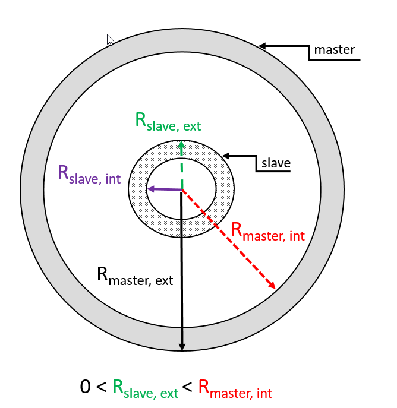
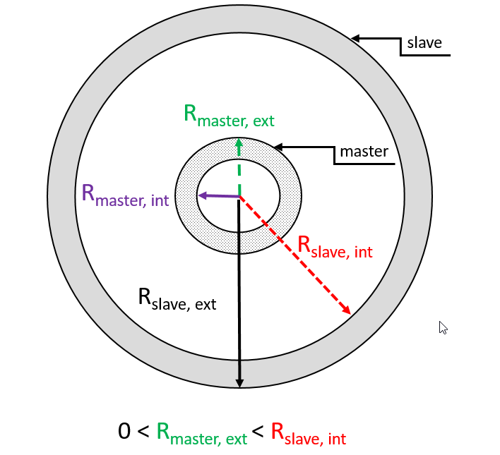

== Appendix A: Frequently Asked Questions

[[faq_modelling]]
=== Modelling

[[faq_modelling_pip]]
==== Recommendations regarding pipe-in-pipe modelling

[[faq_modelling_pip_general]]
===== General recommendations

The contact between the master pipe and the slave pipe will be applied
between a node on the master pipe and an element in the slave pipe. This
results in nodal loads along the master pipe and discrete element loads
along the slave pipe. This is similar to the roller contact which is
described in the Theory Manual.

The contact stiffness, specified as stiffness per unit length along the
master pipe, should be chosen large enough, but not stiffer than
necessary. When selecting the stiffness it may be useful to consider
penetration for a characteristic force, e.g. weight.

A relatively high stiffness proportional damping may be needed to damp
out the high natural frequencies caused by stiff contact elements.

The contact force does not contribute to bending moment on the element
level. Thus the number of elements in the master and slave pipe should
be chosen large enough to reflect the occurring distributed forces.

Note that the contact points in the master pipe are placed at the first
end of each element plus an additional contact point at the second end
of the last element. If the inner diameter of the master pipe varies,
this may not give the desired contact radius at the node where the
radius changes. This may be avoided by specifying a separate
pipe-in-pipe contact for each segment of the master pipe.

The length of the master pipe should be approximately of the same length
as the slave pipe. As an example if the bellomuth is the master, the
slave pipe (for instance a riser) of the same length as the master. You
may use divide the riser into segments to obtain this. See figures
`Example: pipe-in-pipe modelled as `ENTERED`' and `Example: pipe-in-pipe
modelled as `ENTERED`' in
link:@ref%20stamod_b_incremental_load_data[LOAD GROUP DATA].

[[faq_modelling_pip_input]]
===== Input parameters

* `Master position :` The position of the master pipe in the
pipe-in-pipe contact pair. This option decides if the outer or inner
pipe should be the master pipe. The contact between the master pipe and
the slave pipe will be applied between a node on the master pipe and an
element in the slave pipe. This results in nodal loads along the master
pipe and discrete element loads along the slave pipe. The number of
artificial contact elements is equal to number of nodes in the master
pipe.
* `Stiffness type :` Either constant (linear), or non-linear contact
compression stiffness between the master and slave pipe. In the latter
case, a table of force/displacement pairs must be entered. The contact
stiffness, specified as stiffness per unit length along the master pipe,
should be chosen large enough, but not stiffer than necessary. Very high
stiffness values may lead to long run-times, instability and
high-frequency numerical noise. When selecting the stiffness it may be
useful to consider penetration for a characteristic force and also the
convergence of the results that are of interest.
* `Relative damping level :` Relative damping at estimated eigenperiod
in the master, slave and contact spring system.
* `Damping :` damping coefficient per unit length of master pipe
* `Spring stiffness :` associated with static friction coefficient : The
stiffness used when loading friction forces.
* `Axial friction switch :` This swith controls if the axial friction
between master and slave is included.
* `Rotational friction switch :` This swith controls if the rotational
friction between master and slave is included.
* `Velocity limit :` for change from static to dynamic friction

[[faq_modelling_pip_recommended]]
===== Recommended default values

The following are recommended default values for setting up a typical
pipe-in pipe analysis. It is recommended to always do a parameter
variation after setting up a model to ensure convergence of results and
that damping does not affect modes of interest. Only a small amount of
axial friction is included in the suggested input to improve convergence
(compared to turning axial friction off).

====== Pipe in pipe parameters

[cols=",,",options="header",]
|===
|Parameter |Recommended value |Unit
|Master position |Outer |(-)
|Stiffness type |Linear |(-)
|Linear spring stiffness |1e+5 |(N/m^2)
|Relative damping |0.7-1.0 |(-)
|Damping |0.0 |(Ns/m^2)
|Friction stiffness |2.0e+6 |(N/m)
|Static friction coefficient |1e-3 |(-)
|Dynamic (sliding) friction coefficient |1e-3 |(-)
|Axial friction switch |ON |(-)
|Rotational friction switch |OFF |(-)
|Velocity limit |0.1 |(m/s)
|===

[[faq_modelling_pip_gloading]]
===== Recommended static loading sequence

To improve convergence in the static analysis, it is not recommended to
include pipe-in-pipe contact forces as the first load group. Loading
Volume forces, initially pre-stressed segments etc. before pip-in-pipe
forces will in most cases improve static convergence.

[[faq_modelling_pip_efficient]]
===== Tips for efficient analysis with pipe-in-pipe

* Set Pipe-in-pipe contact to ``entered'' in static calculation
parameters. The internal pipe does not have to be placed in the exact
centre, or even inside of the external pipe, it will be pulled towards
the centre when the contact forces are applied.
* Load Volume forces before pipe-in-pipe forces. This will in many cases
make the application of contact forces much more stable due to the
additional drag forces and weight.
* Setting the external pipe as master will often improve convergence and
run-times.
* It is recommended to use shorter elements in the master pipe. The
opposite may lead to slower convergence and numerical noise.
* Note that the element mesh of the master pipe controls the number of
contact elements and should therefore be chosen carefully with regards
to convergence of results and speed. Use a refined mesh where necessary,
for example in areas where large curvatures and contact is expected,
inside bellmouths/guide-tubes, flexjoints etc. Run times increase
exponentially with number of elements in pipe-in-pipe pairs, so it is
important to keep number of elements to a minimum, but sufficient to
ensure convergence of key results.
* Use linear contact stiffness and start off with a low stiffness for
stability and increase gradually if needed.
* For a typical application, drilling-riser, an element length of 2-3 m
for both the drillpipe and marine riser will be sufficient. In areas
where the drillpipe is bent and large contact forces are expected (for
example around flex-joints/ball-joints), the element length should be
reduced.
* External contact radius of inner pipe must be larger than zero
* If the master position is ``outer'', all segments in the slave(inner)
pipe segments must have external contact radius which is smaller than
the internal contact radius of the outer(master) pipe and larger than
zero. See illustration in the figure `Pipe-in-pipe master is modelled as
outer'.
* If the master position is ``inner'', all segments in the master
(inner) pipe segments must have external contact radius which is smaller
than the internal contact radius of the outer(slave) pipe and larger
than zero. See illustration in the figure `Pipe-in-pipe master is
modelled as inner'.

.Pipeinpipe master is modelled as outer

.Pipeinpipe master is modelled as inner

[[faq_modelling_transfer]]
==== Transfer functions - roll, pitch and yaw

In `RIFLEX` vessel roll, pitch and yaw are given as rotation per wave
slope; i.e. dimensionless. If values are available as rotation per meter
or foot of wave height, a conversion must be performed.

[[faq_modelling_transfer_conversion]]
===== Conversion example:

[[faq_modelling_transfer_linux]]
===== Linux script for conversion of rao values:

....
##! /usr/bin/awk -f

##

##  Expects input as:    freq(rad/s)  trf(rad/m)     phase

##  and gives output as: freq(rad/s)  trf(rad/rad)   phase

##

##  Waterdepth may be given on the command line;

##      convert_trf 'd=100.0' <infile>

##

BEGIN { d = 310.0; g = 9.81}

  NF  { w = $1; i = 0;
          k0 = 0.0; k1 = w*w/g;

##       print i, k1;
        while ( (k1-k0) > 0.00005 || (k0-k1) > 0.00005 ) 
           { i++;
             k0   = k1;
             x    = k0*d;
             tanh = 1.0;
             if (x < 50.) tanh = (exp(x)-exp(-x))/(exp(x)+exp(-x))
             k1   = w*w/(g*tanh);

##            print i, k1
           }
        print $1,$2/k1,$3
      }
....

[[faq_modelling_example]]
==== Example MATLAB script to generate a 3D seafloor grid

The MATLAB scripts `iFundi.m` and `seafloor.m` may be used to generate a
regular spaced grid of 3D seafloor data. seafloor.m includes the set of
(x,y,z) coordinates that define the 3D seafloor.

[[faq_modelling_example_ifundi]]
===== iFundi.m

....
%
%                                   iFundi
%                                   ______
%  
% MATLAB script that generates a RIFLEX seafloor input file, on the basis of
% column based data.
%
% This script is a basis, which is expected to be modified by the user when needed.
%
% Philippe Maincon, MARINTEK, 28/6/2000
%
clear                                                % Clear MATLAB's memory, to
                                                     % avoid surprises
% Read the seafloor data

seafloor;                                            % call the script in file
                                                     % seafloor.m, which defines 3
                                                     % vectors x,y and z, of same
                                                     % size.

% Define the grid to be generated                                                     
                                                                                                          
Xsmin = 540;                                         % define the grid to be
DGX   = .5;                                          % generated
Xsmax = 650;                                         % x values on the grid to be
Ysmin = 80;                                          % between Xsmin and Xsmax, with
DGY   = .5;                                          % step DGX
Ysmax = 140;

% Create the interpolated grid

[b,a]=meshgrid(Ysmin:DGY:Ysmax,Xsmin:DGX:Xsmax);     % for the purpose of
                                                     % interpolation, generate the
                                                     % matrices a and b of x and y
                                                     % data respectively, for each
                                                     % point of the grid.
                                                     % DO NOT switch a and b, x and
                                                     % y. !!!
c=griddata(x,y,z,a,b,'linear');                      % interpolate z data to grid c

% Plot the result - for feedback to the user

figure(1); clf; hold on;axis equal;                  
mesh(a,b,c);                                         % plot the interpolated grid as
                                                     % a "mesh"
plot3(x,y,z,'k.','markersize',3);                    % plot the original data as
                                                     % black dots
grid;                                                % put a grid as background to
                                                     % the plot

% Write the RIFLEX seafloor input file

depth=round(c*100);
[NGX,NGY]=size(depth)
fnut=char(39);zero=0

file=fopen('bottom.rif','w');                        % You can change the name of
                                                     % the file here
fprintf(file,'%s\n','Sample seabed profile');        % the syntax here is that of
                                                     % C language
fprintf(file,'%s %s\n',fnut,'NGX NGY Xsmin Xsmax Ysmin Ysmax DGX DGY');
% Mind that a RIFLEX input file is never to have more than 80 columns...
fprintf(file,'%4d %4d %8.2f %8.2f %8.2f %8.2f %8.2f %8.2f\n',...
              NGX,NGY,Xsmin,Xsmax,Ysmin,Ysmax,DGX,  DGY);
fprintf(file,'%s %s\n',fnut,'XOS YOS ANGOL');
fprintf(file,'%8.2f %8.2f %8.2f\n',zero,zero,zero);
fprintf(file,'%s %s\n',fnut,'Depth of seabed [ul*100]');
for col = 1:NGY
   for lin =1:NGX-1
      fprintf(file,'%8d %s\n',depth(lin,col),'&');
   end
   fprintf(file,'%8d \n',depth(NGX,col));
end   
fclose(file);

%%%%%%%%%%%%%%%%%%%%%%%%%%%%%% end %%%%%%%%%%%%%%%%%%%%%%%%%%%%%%%%%%%%
....

[[faq_modelling_example_seafloor]]
===== seafloor.m

....
tmp=[  46318.500     62176.000    -134.0976
   46319.500     62176.000    -134.0722 
   46320.500     62176.000    -134.0749 
   46321.500     62176.000    -134.0644 
....

[…] ~~~ 46427.125 62283.000 -126.0274 46428.125 62283.000 -125.9467];

x = tmp(:,1)-tmp(1,1); y = tmp(:,2)-tmp(1,2); z = tmp(:,3); clear tmp;
r1 = x<400; r2 = x>400; ~~~

[[faq_analysis]]
=== Analysis

[[faq_analysis_work]]
==== Work array size in STAMOD, DYNMOD and OUTMOD

The size of the work arrays may be specified using the environment
variables `RIFLEX_STAMOD_MEM`, `RIFLEX_DYNMOD_MEM` and
`RIFLEX_OUTMOD_MEM`. The variables give the size in million Bytes,
i.e. 4 times the number of million integer words. The minimum size is 4
and the maximum size is 800. From `RIFLEX` 3.6.17 / 3.7.25 the maximum
size is increased to 1600. The value used is echoed on the `.res` file.

The default size of the `STAMOD` work array is 4 million integer words.
This corresponds to specifying 16.

The default size of the `DYNMOD` work array is 8 million integer words.
This corresponds to specifying 32.

The work array in `OUTMOD` may be specified in `RIFLEX` versions 3.4.7
and higher. The default size of the `OUTMOD` work array is 8 million
integer words. This corresponds to specifying 32.

The procedure for setting environmental variables is described in
link:@ref%20faq_analysis_setting[Setting Environment variables on
Windows] and link:@ref%20faq_linux_setting[Setting Environment variables
on Linux].

The `RIFLEX` for Windows utility should be restarted after setting the
environment variables.

[[faq_analysis_maximum]]
==== Maximum number of arrays on the ifnsta, ifnirr and ifndyn files

The maximum number of arrays on the `ifnsta`, `ifnirr` and `ifndyn`
files may be specified using the environment variables
`RIFLEX_MAXSTA_IFNSTA`, `RIFLEX_MAXIRR_IFNIRR` and
`RIFLEX_MAXDYN_IFNDYN`. The values used are echoed on the `_stamod.res`
or `_dynmod.res` file.

The minimum size of `RIFLEX_MAXSTA_IFNSTA` is 2000 and the maximum is
2000000. The default is 20000.

The minimum size of `RIFLEX_MAXIRR_IFNIRR` is 100 and the maximum is
100000. The default is 2000.

The minimum size of `RIFLEX_MAXDYN_IFNDYN` is 50000 and the maximum is
2000000. The default is 200000.

The procedure for setting environmental variables is described in
link:@ref%20faq_analysis_setting[Setting Environment variables on
Windows] and link:@ref%20faq_linux_setting[Setting Environment variables
on Linux].

The `RIFLEX` for Windows utility should be restarted after setting the
environment variables.

[[faq_analysis_transforming]]
==== Transforming time series on file ifndyn

After completing the time domain simulation, `DYNMOD` reads stored
displacements, forces and curvature back from the `ifndyn` file and
extracts times series which are then stored on the `ifndyn` file for
subsequent use by `OUTMOD`. This will cause a lot of file IO if storage
is specified for many response quantities at many time steps and may be
very time consuming.

Depending on the available space in the `DYNMOD` work array, `DYNMOD`
may not be able to transform the time series for all stored nodes /
elements at the same time. Check the `dynmod.res` file for information
about the time series transformation, e.g. for a very small test case:

....
Transforming displacements to time series in
1 groups of 50 nodes/elements each
took 0.06 s (wall clock time)
....

If the transformation is split in many groups, increasing the size of
the `DYNMOD` work array may help (ref FAQ
link:@ref%20faq_analysis_work[Work array size in STAMOD, DYNMOD and
OUTMOD]).

The amount of data transformed may be reduced by not storing response
for nodes / elements that are not needed for post-processing in
`OUTMOD`; e.g. for presentation of times series, response statistics,
fatigue damage, distance time series. Note that one can obtain minima,
maxima, mean, standard deviation and estimated period on the
`dynmod.mpf` file even if the response quantities are not stored.

If the transformation remains unacceptably time consuming, a solution
may be to run the simulation twice. The initial simulation may either be
a shorter simulation with full storage or a long simulation without
storage. The response quantities of interest may then be selected from
the time series or from the key response on the `mpf` file and the
simulation rerun storing only the selected response.

[[faq_analysis_setting]]
==== Setting environment variables on Windows

Environmental variables may be used to specify work array size or the
maximum number of arrays on files, see
link:@ref%20faq_analysis_work[Work array size in STAMOD, DYNMOD and
OUTMOD] and link:@ref%20faq_analysis_maximum[Maximum number of arrays on
the ifnsta, ifnirr and ifndyn files]. If not set, default values will be
used by `RIFLEX`. For example to increase the `DYNMOD` work array to
twice the default size, set `RIFLEX_DYNMOD_MEM` to 64.

On Windows 7: 1. Click on Start at the lower left corner of the screen
2. Right mouse click on Computer in the right hand column 3. Choose
Properties at the bottom of the menu that pops up 4. Choose Advanced
System Settings at the bottom left of the System window 5. Choose
Environment Variables at bottom right 6. Set the desired variables 7.
Choose OK to save the settings 8. Restart any command line window in
order to update your environment

[[faq_analysis_running]]
==== Running Linux scripts on Windows

The CYGWIN package (http://www.cygwin.com/) will enable you to run
Linux-style shell scripts on your Windows machine.

[[faq_extracting]]
=== Extracting Results

[[faq_extracting_reading]]
==== Reading RIFLEX results in MATLAB

The contents of the binary additional result files from `DYNMOD` may be
read:

....
fid=fopen('noddis.bin');
F=fread(fid,[156 500],'float32');
F=F';
....

The binary additional result files contain two columns more than the
corresponding ASCII files. For `RIFLEX` version before `RIFLEX` 3.6.7
(or development versions before 3.7.8), please add 1 to the specified
column number and note that an extra column appears after the described
columns with data. For `RIFLEX` 3.6.7 (3.7.8) and higher, the column
numbers on the key file are correct.

ASCII file; e.g `.res` and `.mpf` files; may be read using fscanf: ~~~
fid = fopen(`armour_sa_ANGLES_outmod.res'); fseek(fid,5176,`bof');
angle1=fscanf(fid,`%g %g %g %g %g %g',[6,600]); fseek(fid,766,`cof');
angle2=fscanf(fid,`%g %g %g %g %g %g',[6,600]); status = fclose(fid);
~~~

Matrices on a `.mpf` file may alternatively be read using get_matrix.m.

[[faq_extracting_reading_get]]
===== get_matrix.m

....
function matrix=get_matrix(mpffile,title)

%   Matlab function to get the matrices that match the string title
%   from the mpf file mpffile.
%

% *** Open mpf file
fid = fopen(mpffile,'r');

% *** Read entire file into character string

filetext = fscanf(fid,'%c');
fclose(fid);

nlen = length(filetext);

% *** Find start of all matrices on file + dummy pointer at end
ixmat = findstr('MATRIX',filetext);
nmat = length(ixmat);
ixmat(nmat+1) = nlen;

% *** Find start of all matrices of "title"
text = [ 'MATRIX    ' , title ];
ix0 = findstr(text,filetext);
nmat = length(ix0);

% *** Get matrices from file

nlin = 0;
for i=1:nmat

%  fprintf(1,'%s \n', filetext(ix0(i):ix0(i)+60));

   % Find which matrix
   imat=find(ixmat == ix0(i));

   % Start of values - add 10 to skip 'VALUES    '
   ix1 = ixmat(imat) + findstr('VALUES',filetext(ixmat(imat)+1:ixmat(imat+1))) + 10;

   % Values end at start of next matrix
   ix2 = ixmat(imat+1) - 1;

   values = str2num(filetext(ix1:ix2));

   if (i  == 1)
     all_values = shiftdim(values,1);
   else
   all_values = [ all_values , shiftdim(values,1) ];
   end

end

matrix = shiftdim(all_values,1);
....

[[faq_extracting_utility]]
==== Utility programs for STARTIMES files

The utility program `prtsc` may be used to list the contents of a
Startimes file.

The utility program `tsprn` may be used to extract time series from a
Startimes file.

SINTEF Ocean customers may download the utilities from the MSE e-room.

[[faq_extracting_stress]]
==== Stress time series

Stress time series from `OUTMOD` are available in two ways:

* Printed on the `_outmod.res` file if `PRINT` is specified and
`STARTIMES` is not specified
* Stored in Startimes format on on the `_outmod.ts` file if `STARTIMES`
is specified

If stored in Startimes format, time series may be viewed / accessed in
several ways:

* Using the utility MatrixPlot
* Converted to ASCII format using the utility TSPRN (see Utility
programs for STARTIMES files below)
* Port-processed using the Startimes package for time series

[[faq_licensing]]
=== Licensing

[[faq_licensing_getting]]
==== Getting the FLEXlm HOSTID of a PC

The `RIFLEX` FLEXlm license file is generated for a specific computer,
which is identified by its HOSTID. The HOSTID is the MAC address of the
primary network card of the PC where the software will be run.

The easiest way to get the MAC address is to run the command
``ipconfig/all >out.txt`' from the DOS command prompt. The `out.txt`
file may be opened with a text editor, e.g. Notepad. The MAC address is
given by the variable ``Physical Address`' (12 alphanumeric characters).
Mobile PCs will normally have several network cards and thus several MAC
addresses - chose the MAC address under `Local Area Connection', not the
one under `Wireless'.

On Windows 7 the DOS command prompt may be started by choosing Start,
Search programs and files and then typing `cmd`.

On Windows XP the DOS command prompt may be started by choosing Start,
Run and then typing `cmd`. Alternatively, chose Start, All Programs,
Accessories and finally Command Prompt.

Send the `out.txt` file or the MAC address to your license provider so
that they can generate a license file.

[[faq_licensing_specifying]]
==== Specifying the FLEXlm license server or file on Windows

The first time `RIFLEX` is run on a PC a dialog will appear and the user
may specify a license server or a file location.

Choose and specify either a license server, e.g.
``2002@riflex.marin.ntnu.no`' (for non-commercial student use at NTNU)
or chose license file and browse to select the license file on your
computer, e.g. ``C:\SINTEF\ntnu_larsen.lic`'

The specified license server or file will then be stored with other
registry information. To change the specified FLEXlm server or file,
choose `START`, `Run`, `regedit`, `HKEY_LOCAL_MACHINE`, `SOFTWARE` and
then `FLEXlm license manager`. Click with the right mouse button on
`MARINTEK_LICENSE_FILE` and choose `modify` or `delete`.

Several license files or a combination of license files and license
servers may be specified by giving a list with semicolons (;) between
the entries, e.g. ``C:\SINTEF\ntnu_larsen.lic;@gimli`'

[[faq_licensing_error]]
==== FLEXlm error: Terminal Server remote client not allowed

Standalone uncounted licenses are intended for single user use on the PC
with the specified HOSTID. They can therefore not be used via remote
desktop. The solution is to acquire a server license.

[[faq_licensing_trouble]]
==== Troubleshooting FLEXlm license server problems

The first step is to check with the IT staff that the license server is
running and that the `RIFLEX` / `VIVANA` license has been installed.

The second step is to check the specification of the license server on
the computer attempting to run `RIFLEX` / `VIVANA`. See
link:@ref%20faq_licensing_specifying[Specifying the FLEXlm license
server or file on Windows] (or
link:@ref%20faq_linux_specifying[Specifying the FLEXlm license server or
file on Linux]). The entry should be set to `@` and the name of the
license server machine, e.g. `@moses` or `@moses.marintek.sintef.no`. It
is normally not necessary to specify the port, so don’t give a number
before the `@`. Remove any old references to other license servers
and/or license files.

The third step is to run the diagnostic utility lmdiag. On Windows start
a Command Prompt by choosing `START`, `All Programs`, `Accessories` and
finally `Command Prompt`. Run ~~~ lmutil lmdiag -c @SERVER -n
RIFLEX_INPMOD ~~~ replacing `SERVER` with the name of your license
server. This will allow you to check your connection with the license
server and whether the `RIFLEX` / `VIVANA` license has been successfully
installed. You may alternatively run ~~~ lmutil lmdiag -c @SERVER -n ~~~
to obtain a list of licenses that are available from the server.

When the specified license is available, a ``This license can be checked
out'' message will appear. Note that a number of ``No licenses for …''
messages may also appear in the list, e.g.

....
lmutil - Copyright (c) 1989-2003 by Macrovision Corporation. All rights reserved.
FLEXlm diagnostics on Tue 11/11/2008 11:26

-----------------------------------------------------
License file: 27000@moses
-----------------------------------------------------
No licenses for RIFLEX_INPMOD in this license file
-----------------------------------------------------
License file: 27001@moses
-----------------------------------------------------
"RIFLEX_INPMOD" v1.0, vendor: MARINTEK
License server: moses
floating license expires: 15-jan-2009

This license can be checked out
-----------------------------------------------------
-----------------------------------------------------
License file: 27002@moses
-----------------------------------------------------
No licenses for RIFLEX_INPMOD in this license file
....

Trying to obtain a license that is not available results in only ``No
licenses for…'' messages for all ports.

Specifying an unreachable server name will result in only the first two
lines of text; the line with the lmutul copyright information and the
current date and time.

[[faq_riflex]]
=== RIFLEX for Windows Utility

[[faq_riflex_specifying]]
==== Specifying program modules in RIFLEX for Windows

The location of the `RIFLEX` program modules is stored on the
`RIFLEX4Win.INI` file which is located on the same directory as
`RIFLEX4Win.exe`. If the location is not specified on the
`RIFLEX4Win.INI` file, e.g., when `RIFLEX` for Windows is started for
the first time, the location is set to `RIFLEX_HOME\bin` using the
environmental variable `RIFLEX_HOME`. The `INI` file `RIFLEX4Win.INI` is
updated when `RIFLEX` for Windows is closed.

The location may thus be reset by replacing the `RIFLEX4Win.INI` file,
resetting the `RIFLEX_HOME` environmental variable and then restarting
`RIFLEX` for Windows. The `RIFLEX4Win.INI` file may be re-downloaded or
edited by the user.

Overwriting the `INI` file may also be necessary if the directory where
`RIFLEX` was last run is no longer available.

Alternatively, the path to the executables may be specified in `RIFLEX`
for Windows. Select `Options` and then `Programs` and set the correct
folder name for `HOME` and the individual program modules `INPMOD`,
`STAMOD`, … .

The same procedure is applicable for `VIVANA` for Windows. This allows
the user to have separate `RIFLEX` and `VIVANA` installations, using the
correct `INPMOD` and `STAMOD` modules in each.

[[faq_riflex_error]]
==== Run-time error 9: subscript out of range

This error message indicates that `RIFLEX` for Windows cannot find the
expected key data for plotting. It is usually caused by empty or
incomplete `.mpf` files and may occur after running an analysis or when
starting `RIFLEX` for Windows or selecting a new directory.

The immediate remedy is usually to delete the offending files with the
`mpf` suffix on the directory.

Check the `RIFLEX` / `VIVANA` `.res` files to see if the problem is
caused by an error in the analysis; e.g. the analysis has been
interrupted or failed. It may also occur after a successful analysis if
no plots were stored on the `.mpf` file; e.g. pure Catenary `STAMOD`
analyses, static analyses with the parameter `IFILFM = 0`, dynamic
simulations that are shorter than the specified start time for response
envelope calculation or where envelopes are not calculated or stored.
Please check the `STAMOD` data group `STAMOD CONTROL INFORMATION` and
the `DYNMOD` data groups `ENVELOPE CURVE SPECIFICATION` and
`REGWAVE PRINT OPTIONS`.

[[faq_linux]]
=== Linux

[[faq_linux_specifying]]
==== Specifying the FLEXlm license server or file on Linux

Before running `RIFLEX` for the first time the environment variable
`MARINTEK_LICENSE_FILE` must be set to the license server or file
location, e.g. ~~~ MARINTEK_LICENSE_FILE=``@flexlm'' ~~~ ~~~
MARINTEK_LICENSE_FILE=``/home/ep/riflex_test.lic'' ~~~ or (for
non-commercial student use at NTNU) ~~~
MARINTEK_LICENSE_FILE=``2002@riflex.marin.ntnu.no'' ~~~

This value will be stored on the file `.flexlmrc` in the user’s home
directory the first time one runs `RIFLEX`. This file may later be
edited if necessary.

Several license files or a combination of license files and license
servers may be specified by giving a list with semicolons (;) between
the entries, e.g., ~~~
MARINTEK_LICENSE_FILE=``/home/ep/riflex_test.lic;@flexlm'' ~~~

[[faq_linux_setting]]
==== Setting Environment variables on Linux

Environmental variables be used to specify work array size or the
maximum number of arrays on files, see
link:@ref%20faq_analysis_work[Work array size in STAMOD, DYNMOD and
OUTMOD] and link:@ref%20faq_analysis_maximum[Maximum number of arrays on
the ifnsta, ifnirr and ifndyn files]. If not set, default values will be
used by `RIFLEX`. For example to increase the `DYNMOD` work array to
twice the default size.

To set in a Bourne / Korn / Bash shell ~~~ export
RIFLEX_DYNMOD_MEM=``500'' ~~~
