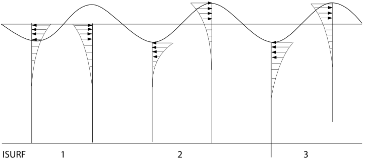
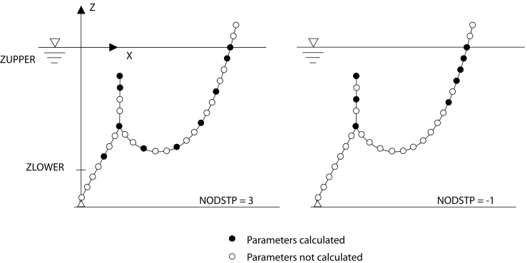
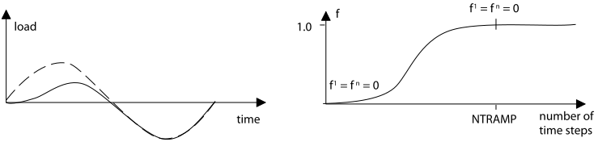

== Input to DYNMOD

[[dynmod_general_information]]
=== General Information

The input description to the `DYNMOD` module is divided into 5 sections,
each section describing one data-section referred to as A-E.

* Data Group A: link:@ref%20dynmod_a[Control Information]
* Data Group B: link:@ref%20dynmod_b[Free Vibration Analysis]
* Data Group C: link:@ref%20dynmod_c[Regular Wave, Time Domain Analysis]
* Data Group D: link:@ref%20dynmod_d[Irregular Wave, Time Domain
Analysis]
* Data Group E: link:@ref%20dynmod_e[Time Domain Procedure and File
Storage Parameters]

Three different types of analysis are possible. Complete input for these
types is shown in the list below.

* Type number 1, Free vibration, requires the data sections A and B.
* Type number 2, Regular wave, requires the data sections A, C and E.
* Type number 3, Irregular wave, requires the data sections A, D and E.

[[dynmod_a]]
=== Data Group A: Control Information

This data-group is mandatory for all types of analysis with `DYNMOD`.
The prescribed sequence must be followed.

[[dynmod_a_principal]]
==== Principal run parameters

[[dynmod_a_principal_data]]
===== Data group identifier, one input line

....
DYNMod CONTrol INFOrmation CHVERS
....

* `CHVERS: character(8)`: RIFLEX input file version, e.g. 3.2

[[dynmod_a_principal_heading]]
===== Heading, three input lines

* Heading, line no 1
* Heading, line no 2
* Heading, line no 3

Identification of the run by alphanumerical text

Always three input lines which may all be blank. Each line may contain
up to 60 characters

[[dynmod_a_principal_options]]
===== Options and identifiers, one input line

....
IRUNCO IANAL IDRIS IDENV IDSTAT IDIRR IDRES
....

* `IRUNCO: character(4), default: DATA`: Code for data check or
executable run
** `= FREM`: Data generation for `FREMOD`
** `= DATA`: Data check
** `= ANALysis`: Analysis
* `IANAL: character(4)`: Type of analysis to be performed
** `= EIGEn`: Eigenvalue analysis.
*** Data section B must be given
** `= REGUlar`: Regular wave, time domain analysis.
*** Data sections C and E must be given.
** `= IRREgular`: Irregular wave, time domain analysis.
*** Data sections D and E must be given.
* `IDRIS: character(6)`: Data set identifier corresponding to data for
one riser system established by `INPMOD` and followed by a static
analysis. See link:@ref%20inpmod_data_group_b_single_riser_data[INPMOD:
Data Group B: Single Riser Data] and
link:@ref%20stamod_a_principal_options[STAMOD: Options and print
switches].
* `IDENV: character(6)`: Environment identifier, corresponding to data
for one environment on file established by `INPMOD`. See data-group
link:@ref%20inpmod_d_identification[INPMOD: Identification of the
environment] of input description for `INPMOD`.
** Reference to actual wave case is given in a later data-group
** Dummy for `IRUNCO=DATAcheck`
* `IDSTAT: character(6)`: Static condition identifier, corresponding to
data on file established by `STAMOD`. See
link:@ref%20stamod_a_principal[STAMOD: Principal run parameters] of
input description for `STAMOD`.
* `IDIRR: character(6)`: Data set identifier for irregular wave and
motion data, either established by a previous run or used as reference
to results stored on file by this run.
* `IDRES: character(6)`: Data set identifier for this run, used as
reference to results stored on files

[[dynmod_a_static]]
==== Static load condition

For special purposes it may be convenient to change applied static loads
at the start of dynamic analysis. This option should be used with care!
One useful application is for analysing free vibration after scaling a
static nodal force to zero (`SCALSF=0.0`).

Note that some static loads are applied and some modelling features are
activated in dynamic analysis even if they were not applied nor
activated in static analysis. See also
link:@ref%20stamod_gen_comment[Note: Static Analysis with Fixed
Parameters and Parameter Variation].

[[dynmod_a_static_data]]
===== Data group identifier, one input line

....
STATic LOAD CONDition
....

[[dynmod_a_static_scaling]]
===== Scaling parameters, one line

....
SCALVF SCALSF SCALCF
....

* `SCALVF: real, default: 1`: Scaling of volume forces
* `SCALSF: real, default: 1`: Scaling of specified (nodal) forces
* `SCALCF: real, default: 1`: Scaling of current velocities

All forces are scaled simultaneously as
latexmath:[$\mathrm{F_s=SCALiF\times F_s^0}$] Only `SCALSF` is active in
the present version of the program.

[[dynmod_a_random]]
==== Random number generator

In version 4.18 and later, the algorithm for generating pseudo-random
numbers may be selected by the user. The ``mersenne twister'' is the
recommended method and should be used unless backwards compatibility
with previous versions is required. Note that the default value may
change in a future release. The choice of random number generator will
apply to: - generation of irregular wave time series - initial phase
angles for time domain VIV loads specified for cross-sections in INPMOD
- generation of phase angles for application of harmonic loads from a
VIVANA frequency domain analysis.

It has been identified that the legacy method can give non-gaussian and
non-stationary wave elevation in SIMO for short crested waves with more
than about 30-50 discrete directions, depending on wave spectrum and
simulation duration. By choosing the mersenne twister, these issues are
avoided.

For coupled analysis, wave time series will be generated using the
random number generator specified in SIMA.

[[dynmod_a_random_iden]]
===== Data group identifier, one input line

....
RANDom NUMBer GENErator
....

[[dynmod_a_random_input]]
===== Random number generator input, one line

....
CHRAN  ISEED
....

* `CHRAN: character (7), default: LEGACY`: Choice of random number
generator
** `= 'LEGACY'`: Legacy random number generator used. Results will be
consistent with previous RIFLEX versions.
** `= 'TWISTER'`: Mersenne Twister’ random number generator used.
Results will NOT be consistent with previous RIFLEX versions.
* `ISEED: integer, default: 7`: Starting parameter of random number
generator for use when input of starting value is not available;
e.g. time domain VIV loads. Currently not used.

[[dynmod_b]]
=== Data Group B: Free Vibration Analysis

This data-group is given if and only if `IANAL=EIGEn`, see
link:@ref%20dynmod_a_principal_options[Options and identifiers, one
input line].

[[dynmod_b_free]]
==== Free vibration options

[[dynmod_b_free_data]]
===== Data group identifier, one input line

....
FREE VIBRation OPTIons
....

[[dynmod_b_free_number]]
===== Number of eigenvalues and -vectors, one input line

....
NEIG NVEC
....

* `NEIG: integer`: Number of eigenvalues to be calculated and stored on
file
* `NVEC: integer`: Number of eigenvectors to be calculated and stored on
file

[[dynmod_b_free_computation]]
===== Computation parameters, one input line

The parameters below correspond to Lanczos’ method for solution of
eigenvalue problems. For a detailed discussion, see B. Nour-Omid, B.N.
Parlett, R.L. Taylor: Lanczos versus Subspace Iteration for Solution of
Eigenvalue Problems, International Journal for Numerical Methods in
Engineering, Vol. 19, pp. 859-871, 1983. or B.N. Parlett: The Symmetric
Eigenvalue Problem, Prentice-Hall, 1980.

....
EPS1 EPS2 EPS3 KSR MAXIT KEX SHIFT MAXNIV
....

* `EPS1: real, default: 0`: Maximum acceptable relative error in
computed eigenvalues
* `EPS2: real, default: 0`: Limit value for singularity test during
factorization
* `EPS3: real, default: 0`: Orthogonality limit:
** If
latexmath:[$\mathrm{\boldsymbol{\mathrm{v}}_i\,^T\boldsymbol{\mathrm{v}}_i=\delta_{ii}}$]
and
latexmath:[$\mathrm{\boldsymbol{\mathrm{v}}_i\,^T\boldsymbol{\mathrm{v}}_j=\delta_{ij}}$]
and latexmath:[$\mathrm{|\delta_{ij}|<EPS3\times \delta_{ii}}$],
latexmath:[$\mathrm{\quad\boldsymbol{\mathrm{v}}_i}$] and
latexmath:[$\mathrm{\boldsymbol{\mathrm{v}}_j}$] are orthogonal
* `KSR: integer, default: 1`: Start vector code:
** `KSR =`latexmath:[$\mathrm{\pm}$]`1`: a pseudo-random start vector is
generated by the eigenvalue solver
** `KSR =`latexmath:[$\mathrm{\pm}$]`2`: the diagonal of the mass matrix
is used as start vector
** `KSR =`latexmath:[$\mathrm{\pm}$]`3`: a start vector of unit elements
is used
** For positive `KSR` the start vector is premultiplied with *H* before
use; if a negative value is specified the start vector is used directly.
* `MAXIT: integer, default: 5`: Maximum no of iterations in
reorthogonalization.
** If a negative value is specified, reorthogonalization is not
iterative; e.g. `MAXIT = -2` will cause a two-pass Gram-Smith
orthogonalization to be employed to all new
latexmath:[$\mathrm{\boldsymbol{\mathrm{v_{}}}_i}$] (i>1), irrespective
of `EPS3`.
** For high values of `NEIG` (>50) a doublepass orthogonalization is
recommended (`MAXIT = -2`)
* `KEX: integer, default: 0`: Parameter controlling the frequency with
which the small tridiagonal eigenvalue problem is solved.
** Must be in the range of `0 <= KEX <= 5`.
** If a zero value is specified, a default value of 2 is used
* `SHIFT: real, default: 0`: The shift value
latexmath:[$\mathrm{\sigma }$]
* `MAXNIV: integer, default: 0`: Number of Lanczos steps to be used.
** A default value suitable for the eigenvalue routines is automatically
computed if a `0` is specified.
** `MAXNIV` should only be given a value latexmath:[$\mathrm{\neq }$]
`0` for small problems

If zero or negative values are specified for `EPS1-EPS3` default values
are inserted

[[dynmod_b_print]]
==== Print options for results

[[dynmod_b_print_data]]
===== Data group identifier, one input line

....
EIGEnvalue PRINt OPTIons
....

[[dynmod_b_print_selection]]
===== Print selection parameters, one input line

....
NPEIG NPVEC IPRESW
....

* `NPEIG: integer`: Number of eigenvalues to be printed ( <= `NEIG`)
* `NPVEC: integer`: Number of eigenvectors to be printed ( <= `NVEC`)
* `IPRESW: integer, default: 0`: Debug print switch for eigenvalue
routines

[[dynmod_b_termination]]
==== Termination of input data

To terminate an input data stream, simply give the following, which is
interpreted as a data group identifier.

....
END
....

Note that the `END` image cannot be omitted

[[dynmod_c]]
=== Data Group C: Regular Wave, Time Domain Analysis

This data group is given for `IANAL = REGUlar`, see
link:@ref%20dynmod_a_principal_options[Options and identifiers, one
input line]. Data-group A and E must also be given for complete
definition of a regular time domain analysis.

[[dynmod_c_parameters]]
==== Parameters for definition of analysis and further input

[[dynmod_c_parameters_data]]
===== Data group identifier, one input line

....
REGUlar WAVE ANALysis
....

[[dynmod_c_parameters_analysis]]
===== Analysis parameters, one input line

....
NPER NSTPPR IRWCN IMOTD
....

* `NPER: integer`: Number of periods for regular wave analysis,
referring to wave or motion periods (of first vessel)
* `NSTPPR: integer, default: 80`: Number of integration time steps per
period, recommended value: 50-120
* `IRWCN: integer`: Wave parameter
** `IRWCN = 0`: No wave acting, motions must be present
** `IRWCN = N`: Wave acting. Regular wave case N on actual environment
used in present analysis
** If no waves are acting, the period for harmonic motions is specified
in link:@ref%20dynmod_c_regular_definition_motion_amplitudes[Motion
amplitudes of support vessel, one input line]
* `IMOTD: integer`: Platform motion parameter
** `IMOTD = 0`: No motions, waves must be present
** `IMOTD = 1`: Platform motion generated on the basis of wave data
(wave period and amplitude) and motion transfer functions. Reference to
transfer functions given in
link:@ref%20dynmod_a_principal_options[Options and identifiers, one
input line].
** `IMOTD = 2`: Platform motions specified in
link:@ref%20dynmod_c_regular[Regular vessel motion]

The platform motions are independent of the wave loading parameters
given in link:@ref%20dynmod_c_load[Load modelling, regular waves].

Extreme values of response parameters from last integration period will
normally be stored on file (cfr. link:@ref%20dynmod_e_displacement[File
storage of displacement response]). In addition, displacement histories
from selected nodes and force and curvature histories from selected
elements can be stored if wanted. Specification of such data storage is
given in data groups link:@ref%20dynmod_e_displacement[File storage of
displacement response], link:@ref%20dynmod_e_internal[File storage for
internal forces] and link:@ref%20dynmod_e_curvature[File storage for
curvature response].

[[dynmod_c_load]]
==== Load modelling, regular waves

This data group is given if `IRWCN >= 1` (data group
link:@ref%20dynmod_c_parameters_analysis[Analysis parameters, one input
line] above).

[[dynmod_c_load_data]]
===== Data group identifier, one input line

....
REGUlar WAVE LOADing
....

[[dynmod_c_load_method]]
===== Method for wave load calculation, one input line

....
IWTYP ISURF IUPPOS
....

* `IWTYP: integer, default: 1`: Wave theory parameter
** `IWTYP = 1`: Airy linear wave theory
** `IWTYP = 2`: Stoke 5th order wave theory
* `ISURF: integer, default: 1`: Sea surface definition, see the figure
`Definition of sea surface' below.
** Dummy if `IWTYP = 2`
** `ISURF = 1`: Integration of wave forces to mean water level
** `ISURF = 2`: Integration of wave forces to wave surface, deformation
of potential by stretching and compression
** `ISURF = 3`: Integration of wave forces to wave surface, move of
potential to actual surface
** `ISURF = 4`: Integration of wave forces to wave surface by keeping
the potential constant from mean water level to wave surface
* `IUPPOS: integer, default: 2`: Riser position parameter
** `IUPPOS = 0`: as 1, but the riser is kept fixed in static position,
for computation of surface penetrating element. I.e. a node that is wet
or dry at the end of the static analysis will continue to be considered
wet or dry with regards to kinematics in the dynamic simulation.
Recommended only for comparison with linear methods.
** `IUPPOS = 1`: Wave induced velocities and accelerations calculated at
static riser position
** `IUPPOS = 2`: Wave induced velocities and accelerations calculated at
updated (dynamic) positions

Note: The option `IUPPOS = 0` cannot be combined with linear analysis,
`ITDMET = 1`, or nonlinear analysis, `ITDMET = 2` and `SIMO` bodies.

.Definition of sea surface

[[dynmod_c_regular]]
==== Regular vessel motion

This data group is given only if `IMOTD=2` (see input group
link:@ref%20dynmod_c_parameters_analysis[Analysis parameters, one input
line]).

[[dynmod_c_regular_data]]
===== Data group identifier, one input line

....
REGUlar VESSel MOTIon
....

[[dynmod_c_regular_definition]]
===== Definition of vessel motion, two lines for each vessel

`Motion amplitudes of support vessel' and `Motion phase angles' must be
given for all `NVES` vessels in systems (totally 2x`NVES` lines).

[[dynmod_c_regular_definition_motion_amplitudes]]
====== Motion amplitudes of support vessel, one input line

Forced displacements are specified for the support vessel. Forced
displacements for the terminal points are found by transformations.

....
XAMP YAMP ZAMP XRAMP YRAMP ZRAMP PER
....

* `XAMP: real`: Motion amplitude, global x-direction
latexmath:[$\mathrm{[L\]}$]
* `YAMP: real`: Motion amplitude, global y-direction
latexmath:[$\mathrm{[L\]}$]
* `ZAMP: real`: Motion amplitude, global z-direction
latexmath:[$\mathrm{[L\]}$]
* `XRAMP: real`: Motion amplitude, global x-rotation
latexmath:[$\mathrm{[degrees\]}$]
* `YRAMP: real`: Motion amplitude, global y-rotation
latexmath:[$\mathrm{[degrees\]}$]
* `ZRAMP: real`: Motion amplitude, global z-rotation
latexmath:[$\mathrm{[degrees\]}$]
* `PER: real`: Period of motion latexmath:[$\mathrm{[T\]}$]

`PER` is dummy input if a regular wave is specified, i.e. `IRWCN > 0`
(data group link:@ref%20dynmod_c_parameters_analysis[Analysis
parameters]). +
In the case of multiple vessels, `PER` is only read for the first vessel
and the specified period used for all vessels.

[[dynmod_c_regular_definition_motion_angles]]
====== Motion phase angles, one input line

....
XPHA YPHA ZPHA XRPHA YRPHA ZRPHA
....

* `XPHA: real`: Phase angle, x-motion latexmath:[$\mathrm{[degrees\]}$]
* `YPHA: real`: Phase angle, y-motion latexmath:[$\mathrm{[degrees\]}$]
* `ZPHA: real`: Phase angle, z-motion latexmath:[$\mathrm{[degrees\]}$]
* `XRPHA: real`: Phase angle, x-rotation
latexmath:[$\mathrm{[degrees\]}$]
* `YRPHA: real`: Phase angle, y-rotation
latexmath:[$\mathrm{[degrees\]}$]
* `ZRPHA: real`: Phase angle, z-rotation
latexmath:[$\mathrm{[degrees\]}$]

All phase angles are defined as follows:

Positive angle: Forward phase shift; motion before sea surface at global
origin.

Surface:
latexmath:[$\mathrm{\eta =\eta _asin(\omega t+\phi _p),\quad\phi _p=-kxcos(\beta )-kysin(\beta )}$]

Motion: latexmath:[$\mathrm{x_i=x_{ai}sin(\omega t+\phi _i)}$]

Where: - latexmath:[$\mathrm{x_i}$] is equation of motion -
latexmath:[$\mathrm{\eta _a}$] is wave amplitude -
latexmath:[$\mathrm{x_{ai}}$] is motion amplitude `XAMP`, `YAMP`, etc. -
latexmath:[$\mathrm{\phi _i}$] is phase angle, `XPHA`, `YPHA`, etc. -
latexmath:[$\mathrm{k}$] is wave number - latexmath:[$\mathrm{\omega }$]
is angular frequency - latexmath:[$\mathrm{x,y}$] is global coordinates

If the forward phase shift latexmath:[$\mathrm{\phi _i^{xy}}$] between
wave and motion at the same point (x,y) is known, the phase into
`RIFLEX` must be modified as follows:

latexmath:[$\mathrm{\phi _i=\phi _i^{xy}+\phi _p}$]

in order to obtain phase relation between motion at (x,y) and a wave
with start at global origin as defined above.

[[dynmod_d]]
=== Data Group D: Irregular Wave, Time Domain Analysis

This data group is given for `IANAL=IRREgular`, see
link:@ref%20dynmod_a_principal_options[Options and identifiers, one
input line]. Data group A and E must also be given for complete
definition of an irregular time domain analysis.

[[dynmod_d_parameters]]
==== Irregular time series parameters

The input in this data group is used to specify the method used for
computation of the underlaying irregular waves, i.e. the seed used for
random number generation and the frequency resolution.

The data group may be skipped if default values are wanted. The data
group is dummy if any floater force models are present in the model.
(The analysis is done in combination with `SIMO`, so-called coupled
analysis, and the irregular time series parameters defined by input to
`SIMO`).

[[dynmod_d_parameters_data]]
===== Data group identifier, one input line

....
IRREgular TIMEseries PARAmeters
....

[[dynmod_d_parameters_parameters]]
===== Parameters, one input line

....
IRAND TIMGEN DTGEN CHFREQ CHAMP
....

* `IRAND: integer, default: 1`: Starting parameter of random number
generator
* `TIMGEN: real, defaul: 16384`: Length of prescribed wave and motion
time series latexmath:[$\mathrm{[T\]}$]
* `DTGEN: real, defaul: 0.5`: Time increment of pre-sampled time series
latexmath:[$\mathrm{[T\]}$]
* `CHFREQ: character(4), default: FFT`: Option for selecting wave
frequency components
** `= 'FFT'`: Wave frequency components are selected among the FFT
frequencies given by `TIMEGEN` and `DTGEN`. The default criteria are
used to find the first and last frequencies.
* `CHAMP: character(5), default: DET`: Option for selecting wave
component amplitudes
** `= 'DET'`: Deterministic wave amplitudes are used.
** `= 'STOCH'`: Stochastic wave amplitudes are used.
** `= 0`: Interpreted as `DET`. Included for compatibility with earlier
versions.

Note that this data group is dummy for coupled analysis.

Also note that: - `TIMGEN` should be equal or longer than the simulation
length, `TIME`, given in link:@ref%20dynmod_d_analysis[Irregular
response analysis and subsequent input]. - `TIMGEN` will, if necessary,
be increased to give a power of 2 time steps (`DTGEN`). - The actual
time increment used for time domain analysis is defined by the parameter
`DT`, see link:@ref%20dynmod_d_analysis[Irregular response analysis and
subsequent input]. - To represent the wave surface- and motion time
series properly, time increments, `DTGEN`, in the range 0.5-1 s are
normally acceptable.

[[dynmod_d_analysis]]
==== Irregular response analysis and subsequent input

[[dynmod_d_analysis_data]]
===== Data group identifier, one input line

....
IRREgular RESPonse ANALysis
....

[[dynmod_d_analysis_parameters]]
===== Analysis parameters, one input line

....
IRCNO TIME DT CHWAV CHMOT CHLFM TBEG ISCALE
....

* `IRCNO: integer/character`: Irregular wave case number in actual
environment applied in this run. Dummy for coupled analysis.
** `IRCNO = FILE` or `IRCNO = -1`: Wave time series read from file. Data
groups link:@ref%20dynmod_d_irregular_waves[Irregular waves] and
link:@ref%20dynmod_d_wave_and_motion_time_series[Wave time series file]
must be given
* `TIME: real, default: 11000`: Length of simulation
latexmath:[$\mathrm{[T\]}$]
* `DT: real, default: 0.1`: Time step latexmath:[$\mathrm{[T\]}$]
** See below
* `CHWAV: character(4), default: NEW`: Irregular wave indicator
** `= 'NONE'`: No wave forces in present analysis. If specified the
riser will have forced excitation at upper end and oscillate in
undisturbed water or in constant current
** `= NEW`: Wave forces present. New data generated. Data group
link:@ref%20dynmod_d_irregular_waves[Irregular waves] must be given.
* `CHMOT: character(4), default: STAT`: Irregular motion indicator
** `= 'NONE'`: No irregular motions in present analysis
** `= STAT`: Forced irregular motions present. Computation of prescribed
motions will be based on vessel position in final static position.
** `= NEW`: Interpreted as `CHMOT=STAT`
** `= FILE`: Forced irregular motions present. Wave frequency motion
time series read from file. Data group
link:@ref%20dynmod_d_wave_and_motion_frequency[Wave frequency motion
time series file] must be given.
* `CHLFM: character(4), default: 'NONE'`: Low frequency motion indicator
** `= 'NONE'`: No low frequency irregular motions present
** `= FILE`: Forced low frequency irregular motions present. Low
frequency motion time series read from file. Data group
link:@ref%20dynmod_d_wave_and_motion_low_frequency[Low frequency motion
time series file] must be given.
* `TBEG: real, default: 0`: Time in wave and motion time series that
dynamic simulation will start from latexmath:[$\mathrm{[T\]}$]
* `ISCALE: integer, default: 0`: Switch for scaling of terminal point
motions
** `ISCALE = 0`: No scaling
** `ISCALE = 1`: Scaling: Input line
link:@ref%20dynmod_d_analysis_support[Support vessel motion scaling
factors] has to be given

`DT` will be adjusted to get an integer ratio between `DTGEN` and `DT`.
`DT` given as negative integer defines the ratio between time step used
in pre-simulation of waves and/or WF-motions and the time step to be
used in the time simulation. (`DTGEN/DT >= 1`)

`TBEG` allows for arbitrary start point in the pre-generated time
series. If the end of the time series is reached during dynamic
integration, a warning is written and motions and water kinematics will
be taken from the start. This can also be useful for elimination of
transients from the time series statistics.

An irregular analysis without waves or vessel motions may be run by
specifying `CHWAV = 'NONE'`, `CHMOT = 'NONE'` and `CHLFM = 'NONE'`.
`IRCNO` must still reference a legal irregular wave case, but the wave
will not be used as no wave kinematics will be generated and not vessel
motions be applied.

[[dynmod_d_analysis_support]]
===== Support vessel motion scaling factors. Only given for ISCALE=1. One line for each vessel in system (NVES lines)

....
SCALX SCALY SCALZ SCALXR SCALYR SCALZR
....

* `SCALX: real, default: 1`: Scaling for global X-motion
latexmath:[$\mathrm{[1\]}$]
* `SCALY: real, default: 1`: Scaling for global Y-motion
latexmath:[$\mathrm{[1\]}$]
* `SCALZ: real, default: 1`: Scaling for global Z-motion
latexmath:[$\mathrm{[1\]}$]
* `SCALXR: real, default: 1`: Scaling for global X-rotation
latexmath:[$\mathrm{[1\]}$]
* `SCALYR: real, default: 1`: Scaling for global Y-rotation
latexmath:[$\mathrm{[1\]}$]
* `SCALZR: real, default: 1`: Scaling for global Z-rotation
latexmath:[$\mathrm{[1\]}$]

The motions are scaled directly as
latexmath:[$\mathrm{DISP_i=SCAL_i\times Motion_i}$] where
latexmath:[$\mathrm{Motion_i}$] is the precomputed motion quantity
latexmath:[$\mathrm{_i}$].

[[dynmod_d_irregular_waves]]
==== Irregular waves

This data group is omitted for `CHWAV='NONE'`, see data group
link:@ref%20dynmod_d_analysis_parameters[Analysis parameters, one input
line].

The data group also controls the method for computation of wave
kinematics and motions of the support vessels. In this context FFT or
FFT and cosine series combined means that the vessel motion is
pre-generated by means of FFT, while the wave kinematics are either
pre-generated (FFT) or computed during the actual simulation by use of
cosine series. ``Cosine series only'' means that both vessel motion and
wave kinematics are computed based on cosine series. It is possible to
overrule the cosine series application for wave kinematics for parts of
the the system by specifying FFT in the detailed specifications, see
link:@ref%20dynmod_d_irregular_waves_procedure_additional[Additional
detailed specification of wave kinematics points (optional)]. (``FFT''
or ``FFT and cosine series combined only''.)

[[dynmod_d_irregular_waves_data]]
===== Data group identifier, one input line

....
IRREgular WAVE PROCedure
....

[[dynmod_d_irregular_waves_procedure]]
===== Procedure for wave force calculation, one input line

....
IUPPOS ISURF KINOFF CHSTEP NODSTP ZLOWER ZUPPER IOPDIF IOPWKI
....

* `IUPPOS: integer, default: 1`: Position for calculation of irregular
wave kinematics
** `= 1`: Kinematics at static positions
** `= 2`: Kinematics at instantaneous positions calculated by summation
of cosine components.
** `= -2`: Kinematics at static positions calculated by summation of
cosine components. This option is mainly useful for testing.
** `= 0`: As 1 but riser fixed in static position, (``wet'' elements
also ``wet'' dynamic)
* `ISURF: integer, default: 1`: Code for kinematics in wave zone
** `= 1`: Integration of wave forces to mean water level
** `= 2`: Integration of wave forces to wave surface by stretching and
compression of the wave potential
** `= 3`: Integration of wave forces to wave surface by moving the
potential to actual surface
** `= 4`: Integration of wave forces to wave surface by keeping the
potential constant from mean water level to wave surface
** `= 5`: 2nd order wave (integration of wave forces to wave surface)
*** The formulation for 2nd order wave kinematics is based on the Stoke
2nd order wave theory. Only available for kinematics calculated at
static position; `IUPPOS = 1 or IUPPOS = 0`.
* `KINOFF: integer, default: 0`: Code for default kinematics points
procedure
** `= 0`: Default procedure on. The initial selection of positions for
computation of kinematics is determined by the parameters `NODSTP`,
`ZLOWER` and `ZUPPER` for all lines in the system. Subsequent
specification (see
link:@ref%20dynmod_d_irregular_waves_procedure_additional[Additional
detailed specification of wave kinematics points (optional)]) will
replace the initial selection.
** `= 1`: Default procedure off. Kinematics will only be computed at
positions given by subsequent specification (see
link:@ref%20dynmod_d_irregular_waves_procedure_additional[Additional
detailed specification of wave kinematics points (optional)])
* `CHSTEP: character(4)`: Code for interpretation of the next parameter
** `= NODE`: Next parameter interpreted as `NODSTP`
* `NODSTP: integer`: Node step for calculating wave kinematics. (Dummy
for `KINOFF = 1`)
** Kinematics calculated for every `NODSTP` node between `ZLOWER` and
`ZUPPER` (see
link:@ref%20Definition_of_NODSTP_ZLOWER_and_ZUPPER[Definition of NODSTP,
ZLOWER and ZUPPER]).
** For intermediate nodes kinematics are derived by linear
interpolation.
** Wave kinematics will always be calculated at submerged supernodes.
** Note that a negative value of `NODSTP` may be given. The distance
between `ZUPPER` and `ZLOWER` is then divided into 4 (equal) intervals
and `NODSTP` is increased from `ABS(NODSTP)` in the upper interval via
`2xABS(NODSTP)` in the next interval and `4xABS(NODSTP`) to
`8xABS(NODSTP)` in the two lower intervals, see
link:@ref%20Definition_of_NODSTP_ZLOWER_and_ZUPPER[Definition of NODSTP,
ZLOWER and ZUPPER].
* `ZLOWER: real, default: -WDEPTH`: Z-coordinate indicating lowest node
position for which wave kinematics are calculated
latexmath:[$\mathrm{[L\]}$]
** See link:@ref%20Definition_of_NODSTP_ZLOWER_and_ZUPPER[Definition of
NODSTP, ZLOWER and ZUPPER].
** Dummy for `KINOFF = 1`
** For `WDEPTH`, see link:@ref%20inpmod_d_water[INPMOD: Water depth and
wave indicator]
* `ZUPPER: real, default: 4 x STD_WA`: Upper limit for wave kinematics
latexmath:[$\mathrm{[L\]}$]
** Dummy for `KINOFF = 1`
** `STD_WA` is the standard deviation of the total wave elevation
* `IOPDIF: integer, default: 0`: Option for specification of wave
kinematic transfer function.
** `IOPDIF = 0`: No transfer function to be specified
** `IOPDIF = 1`: Read transfer functions from the file specified in
link:@ref%20dynmod_d_irregular_waves_procedure_trffile[Wave kinematics
transfer function file name] (below).
* `IOPWKI: integer, default: 0`: Option for specification of wave
kinematic time series.
** `IOPWKI = 0`: No wave kinematics time series to be specified
** `IOPWKI = 2`: Read wave kinematics time series from the binary file
specified in link:@ref%20dynmod_d_irregular_waves_procedure_tsfile[Wave
kinematics time series file name] (below).

`NODSTP`, `ZLOWER` and `ZUPPER` will normally be sufficient for
specifying the selection of wave kinematics points.

Note that for large or complicated systems
link:@ref%20dynmod_d_irregular_waves_procedure_additional[Additional
detailed specification of wave kinematics points (optional)] may be used
to override the selection given by `NODSTP`, `ZLOWER` and `ZUPPER`; e.g.
skip generation of wave kinematics for selected lines, generate
kinematics at more points along an important line.

.Definition of NODSTP ZLOWER and ZUPPER

Note that the definition of ISURF is also used to determine where to
apply wind forces to airfoil cross sections near the water line. That
is, no wind forces are applied to wet sections of the element. The wind
speed is nevertheless taken to be zero at or below the mean water level.

Note that the option `IUPPOS = 0` cannot be combined with linear
analysis, `ITDMET = 1`, or nonlinear analysis, `ITDMET = 2` and `SIMO`
bodies.

[[dynmod_d_irregular_waves_procedure_trffile]]
====== Wave kinematics transfer function file name

This data group is omitted for `IOPDIF = 0` ~~~ CHFDIF ~~~

* `CHFDIF: character(80)`: File name with wave kinematic transfer
function.
** The file format is described in
link:@ref%20dynmod_description_wave[Diffracted Wave Transfer Functions
at Points].

[[dynmod_d_irregular_waves_procedure_tsfile]]
====== Wave kinematics time series file name

This data group is omitted for `IOPWKI = 0`

Wave kinematics read from file will replace the corresponding wave
kinematics calculated by `DYNMOD`. These kinematics will then be used in
the calculation of Morison type hydrodynamic loads on `RIFLEX` elements.
Loads on `SIMO` bodies will NOT be affected.

`RIFLEX` vessel motions based on vessel motion transfer functions and
MacCamy Fuchs and Potential flow loads on `RIFLEX` elements are
per-generated from the wave Fourier components and are therefore NOT
affected by the wave kinematics read from file. Elements with MacCamy
Fuchs or Potential flow loads may not have kinematics read from file.

If kinematics read from file are used in a simulation with `SIMO`
bodies, vessel motions based on vessel motion transfer functions or
pre-generated hydrodynamic loads, the user must ensure that the
kinematics are consistent with the Fourier components.

....
CHFDIF
....

* `CHFWKI: character(80)`: File name with wave kinematic time series.
** The file format is specified by `IOPWKI` and is the same as the
kinematics file with the same format exported from DYNMOD using [Storage
of irregular wave kinematics] (@ref dynmod_d_storage)

....
ICOLMX ICOLTM
....

* `ICOLMX: integer, default: 0`: Maximum number of columns on file. For
binary format, `IOPWKI = 2`, this includes the two columns of FORTRAN
specific data. Please see the key file `key_<prefix>_wavkin.txt`
generated when storing kinematics.
* `ICOLTM: integer, default: 2`: Column number on file for time

[[dynmod_d_irregular_waves_procedure_additional]]
====== Additional detailed specification of wave kinematics points (optional)

As many input lines as needed. Note three alternative formats.

======= For wave kinematics calculated by the program from the undisturbed waves.

....
LINE-ID CHSTEP = NODE NODSTP
....

* `LINE-ID: character(8)`: Line identifier
* `CHSTEP: character(4)`: `= Node`
* `NODSTP: integer`: Node step for calculating wave kinematics
** `= 0`: No kinematics for this line
** `> 0`: Kinematics for each `NODSTP` node

======= For wave kinematics given by wave kinematics transfer functions (diffracted waves)

....
LINE-ID CHSTEP= DIFF ILSEG ILNODE IVES PTNOUS
....

* `LINE-ID: character(8)`: Line identifier
* `CHSTEP: character(4)`: `= DIFF`
* `ILSEG: integer`: Local segment number within line LINE-ID
* `ILNODE: integer`: Local node number within ILSEG
* `IVES: integer`:
** `= 0`: Use undisturbed wave kinematics at this node
** `> 0`: Support vessel number. Used as reference to transfer function
for diffracted wave kinematics.
* `PTNOUS: integer`: Point reference(s) to transfer function for
diffracted wave kinematics

Up to 30 values of PTNOUS may be given on each line. The diffracted
kinematics at the specified node will be generated by interpolation
based on the nearest point references.

======= For wave kinematics given by wave kinematics time series

....
LINE-ID CHSTEP= WKFI ILSEG ILNODE ICOLST
....

* `LINE-ID: character(8)`: Line identifier
* `CHSTEP: character(4)`: `= WKFI`
* `ILSEG: integer`: Local segment number within line LINE-ID
* `ILNODE: integer`: Local node number within ILSEG
* `ICOLST: integer`: Column number for the first wave kinematics time
series for this node

[[dynmod_d_wave_and_motion]]
==== Wave and motion time series files

[[dynmod_d_wave_and_motion_time_series]]
===== Wave time series file

This data group is given only if `IRCNO = FILE`.

[[dynmod_d_wave_and_motion_time_series_data]]
====== Data group identifier, one input line

....
WAVE TIME SERIes
....

[[dynmod_d_wave_and_motion_time_series_file]]
====== Wave time series file information

....
CHFTSF IFORM ICOTIM ICOWAV
....

* `CHFTSF: character(60)`: File name
* `IFORM: integer, default: 1`: File format code
** `= ASCI`: Column organised ASCII file
** `= STAR`: Startimes file
* `ICOTIM: integer, default: 1`: Column number for time
** Dummy for `IFORM = STAR`
* `ICOWAV: integer/real, default: 2`: Column or time series number for
wave elevation

The wave direction is given by the parameter `WADR1` given in `INPMOD`
for the irregular wave case `IRCNO` referred to in
link:@ref%20dynmod_d_analysis_parameters[Analysis parameters, one input
line].

`ICOTIM` and `ICOWAV` will refer to columns on an ASCII file;
e.g. `ICOTIM=1` and `ICOWAV=2` if the time and wave elevation are in the
first and second columns; or to a time series number on a Startimes
file; e.g. `ICOWAV=10.01` for time series 10, version 1.

An arbitrary time step may be used on an ASCII file, while the Startimes
file has a fixed step. Linear interpolation is used to get the motions
at the time step (DTWF)

[[dynmod_d_wave_and_motion_time_series_direction]]
====== Direction, location of measurement and cut-off for filtering

....
WAVDIR XGWAV YGWAV TMIN TMAX
....

* `WAVDIR: real, default: 0`: Wave direction
latexmath:[$\mathrm{[deg\]}$]
* `XGWAV: real, default: 0`: Global x-coordinate for position where time
series is measured
* `YGWAV: real, default: 0`: Global y-coordinate for position where time
series is measured
* `TMIN: real, default: 0`: Period corresponding to cut-off frequency
for filtering
* `TMAX: real, default: 0`: Period corresponding to cut-off frequency
for filtering

If `TMIN` and `TMAX` are both zero: No filtering

If `TMIN` and `TMAX` are both different from zero: band-pass filtering

Filtering is not implemented in present version

[[dynmod_d_wave_and_motion_frequency]]
===== Wave frequency motion time series file

This data group is given only if `CHMOT=FILE`. Note that data must be
given for all vessels in the system.

[[dynmod_d_wave_and_motion_frequency_data]]
====== Data group identifier, one input line

....
WFMOtion TIME SERIes
....

[[dynmod_d_wave_and_motion_frequency_motions]]
====== Wave frequency motions file information, NVES input lines

....
IVES CHFTSF IFORM IKIND IROT ICOTIM ICOXG ICOYG ICOZG ICOXGR ICOYGR ICOZGR
....

* `IVES: integer`: Vessel Number
* `CHFTSF: character(60)`: File name
* `IFORM: character(4), default: ASCI`: File format code
** `= ASCI`: Column organised ASCII file
** `= STAR`: Startimes file
** `= NONE`: No wave frequency motions for this vessel. The remainder of
this input line is dummy
* `IKIND: character(4), default: POSI`: Kind of motion time series input
** `= POSI`: Global positions, i.e. global coordinates. The rotations
are applied in the Euler sequence: Rz-Ry-Rx. Consistent with vessel
motion time series from `SIMO`.
** `= DYND`: Global dynamic displacements; i.e. global coordinates minus
the final static position. The rotations are applied in the Euler
sequence: Rx-Ry-Rz
* `IROT: character(4), default: DEGR`: Unit of rotations
** `= DEGR`: Rotations given in degrees
** `= RADI`: Rotations given in radians
* `ICOTIM: integer, default: 1`: Column number for time
** Dummy for `IFORM = STAR`
* `ICOXG: integer/real, default: 0`: Column or time series number for
specification of global x-motion. Absolute position if `IKIND = POSI`,
relative to static position if `IKIND = DYND`.
* `ICOYG: integer/real, default: 0`: Column or time series number for
specification of global y-motion. Absolute position if `IKIND = POSI`,
relative to static position if `IKIND = DYND`.
* `ICOZG: integer/real, default: 0`: Column or time series number for
specification of global z-motion. Absolute position if `IKIND = POSI`,
relative to static position if `IKIND = DYND`.
* `ICOXGR: integer/real, default: 0`: Column or time series number for
specification of global x-rotation. Absolute position if `IKIND = POSI`,
relative to static position if `IKIND = DYND`.
* `ICOYGR: integer/real, default: 0`: Column or time series number for
specification of global y-rotation. Absolute position if `IKIND = POSI`,
relative to static position if `IKIND = DYND`.
* `ICOZGR: integer/real, default: 0`: Column or time series number for
specification of global z-rotation. Absolute position if `IKIND = POSI`,
relative to static position if `IKIND = DYND`.

Dofs may be omitted by giving `ICOxxx=0`

`ICOxxx` will refer to a column for an ASCII file; e.g. `ICOX=2` if the
dynamic x motion time series is in the second column; or to a time
series number for a Startimes file, e.g. `ICOX=1.02` for time series 1,
version 2.

An arbitrary time step may be used on an ASCII file, while the Startimes
file has a fixed time step. Linear interpolation is used to get the
motions at the time step (`DTWF`).

Translational dofs are given in length units. Rotational dofs are given
in degrees or radians, depending on the option `IROT`.

If only one rotation is nonzero or if all rotations are small, the order
in which the rotations are applied will not be significant.

Please note that the line length of ASCII input files is currently
limited to 260 characters, see link:@ref%20how_to_run_formats[Formats]
in link:@ref%20how_to_run_input[How to Run the Program]. Note that a
RIFLEX input line may be split into several lines on the input file.

[[dynmod_d_wave_and_motion_low_frequency]]
===== Low frequency motion time series file

This data group is given only if `CHLFM=FILE`. Note that data must be
given for all vessels in the system.

[[dynmod_d_wave_and_motion_low_frequency_data]]
====== Data group identifier, one input line

....
LFMOtion TIME SERIes
....

[[dynmod_d_wave_and_motion_low_frequency_file]]
====== Low frequency motions file information, NVES input lines

....
IVES CHFTSF IFORM IKIND IROT ICOTIM ICOXG ICOYG ICOZGR
....

* `IVES: integer`: Vessel Number
* `CHFTSF: character(60)`: File name
* `IFORM: character(4), default: ASCI`: File format code
** `= ASCI`: Column organised ASCII file
** `= STAR`: Startimes file
** `= NONE`: No wave frequency motions for this vessel. The remainder of
this input line is dummy
* `IKIND: character(4), default: POSI`: Kind of motion time series input
** `= POSI`: Global positions, i.e. global coordinates. The rotations
are applied in the Euler sequence: Rz-Ry-Rx. Consistent with vessel
motion time series from `SIMO`.
** `= DYND`: Global dynamic displacements; i.e. global coordinates minus
the final static position. The rotations are applied in the Euler
sequence: Rx-Ry-Rz
* `IROT: character(4), default: DEGR`: Unit of rotations
** `= DEGR`: Rotations given in degrees
** `= RADI`: Rotations given in radians
* `ICOTIM: integer, default: 1`: Column number for time
** Dummy for `IFORM = STAR`
* `ICOXG: integer/real, default: 0`: Column or time series number for
specification of global x-motion. Absolute position if `IKIND = POSI`,
relative to static position if `IKIND = DYND`.
* `ICOYG: integer/real, default: 0`: Column or time series number for
specification of global y-motion. Absolute position if `IKIND = POSI`,
relative to static position if `IKIND = DYND`.
* `ICOZGR: integer/real, default: 0`: Column or time series number for
specification of global z-rotation. Absolute position if `IKIND = POSI`,
relative to static position if `IKIND = DYND`.

Dofs may be omitted by given `ICOxxx=0`

`ICOxxx` will refer to a column for an ASCII file; e.g. `ICOSUR=2` if
the dynamic x motion time series is in the second column; or to a time
series number for a Startimes file, e.g. `ICOX=1.02` for time series 1,
version 2.

An arbitrary time step may be used on an ASCII file, while the Startimes
file has a fixed time step. Linear interpolation is used to get the
motions at the time step (`DTWF`).

Translational dofs are given in length units. Rotational dofs are given
in degrees or radians, depending on the option `IROT`.

If only one rotation is nonzero or if all rotations are small, the order
in which the rotations are applied will not be significant.

[[dynmod_d_print]]
==== Print options for FFT analysis

[[dynmod_d_print_data]]
===== Data group identifier, one input line

....
IRREgular FOURier PRINt
....

[[dynmod_d_print_fourier]]
===== Fourier print options

....
IPMOTI IPWAFO IPHFTS IPLFTS IPTOMO IPVEAC
....

* `IPMOTI: integer, default: 0`: Print option for the main routine
** `<= 0`: No print
** `> 1`: Key information printed
** `> 2`: Some more data printed
** `> 5`: Low level debug print during numerical integration activated
* `IPWAFO: integer, default: 0`: Print option for the wave fourier
component generation
** Not active in present version
* `IPHFTS: integer, default: 0`: Print option for HF-time series
generation
** `<= 0`: No print
** `> 0`: Print of wave frequency vessel motion time series
* `IPLFTS: integer, default: 0`: Print option for LF-time series
generation
** `<= 0`: No print
** `> 0`: Print of low frequency vessel motion time series
* `IPTOMO: integer, default: 0`: Print option for TOTAL motion time
series generation
** `<= 0`: No print
** `> 0`: Print of total vessel motion time series
* `IPVEAC: integer, default: 0`: Print option for generation of water
particle velocities and acceleration
** `<= 0`: No print
** `> 1`: Key information printed
** `> 2`: Some data printed
** `> 5`: Extensive debug print of arrays with water particle velocities
and accelerations

This data-group is normally supposed to be omitted. Increasing value of
print options gives increasing amount of print.

[[dynmod_d_storage]]
==== Storage of irregular wave kinematics (optional)

[[dynmod_d_storage_data]]
===== Data group identifier, one input line

....
IRREgular KINEmatics STORage
....

[[dynmod_d_storage_wave]]
===== Wave kinematics storage options one input line

....
NLKINE IKINFM
....

* `NLKINE: integer, default: 0`: Number of specifications for storage of
wave kinematics
** `= 0`: Wave elevation, velocities and accelerations are stored for
all kinematics nodes. Currently, no other value is allowed.
* `IKINFM: integer, default: 2`: File format for kinematics storage
** `= 1`: ASCII format
** `= 2`: Binary format

Pre-generated wave kinematics are written to `<prefix>_wavkin.asc` or
`<prefix>_wavkin.bin`. Kinematics calculated during the simulation;
`IUPPOS = 2 or -2`; are written to `<prefix>_updkin.asc` or
`<prefix>_updkin.bin`.

The contents are described in `key_<prefix>_wavkin.txt` or
`key_<prefix>_updkin.txt`.

[[dynmod_e]]
=== Data Group E: Time Domain Procedure and File Storage Parameters

This data group must always be given for `IANAL = REGU` and `IRRE` (time
domain analysis) specified in input line
link:@ref%20dynmod_a_principal_options[Options and identifiers, one
input line].

[[dynmod_e_method]]
==== Method of analysis and subsequent input

[[dynmod_e_method_data]]
===== Data group identifier, one input line

....
TIME DOMAin PROCedure
....

[[dynmod_e_method_method]]
===== Method and subsequent input, one input line

....
ITDMET INEWIL
....

* `ITDMET: integer, default: 1`: Method indicator
** `ITDMET = 0`: Prestochastic analysis only. The rest of the data in
input groups E are irrelevant
** `ITDMET = 1`: Linear analysis
** `ITDMET = 2`: Nonlinear analysis. More information to define method
is given in link:@ref%20dynmod_e_nonlinear[Nonlinear step by step
integration]
* `INEWIL: integer, default: 1`: Procedure indicator
** `INEWIL = 1`: Newmark’s procedure
** `INEWIL = 2`: Wilson’s procedure, illegal for non-linear analysis

[[dynmod_e_method_time]]
===== Time integration and damping parameters, one input line

This data group can be omitted if default values are wanted.

....
BETIN GAMMA TETHA A1 A2 A1T A1TO A1B A2T A2TO A2B DAMP_OPT
....

* `BETIN: real, default: 4/6`: Inverse value of beta-parameter of the
Newmark beta-family of integration operators
** `BETIN = 4.0` gives beta=1/4,i.e. constant average acceleration
method
* `GAMMA: real, default: 0.5`: Value of the parameter gamma of the
Newmark operators (usually equal to 0.5)
* `TETHA: real, default: See below`: Value of the parameter tetha in
Wilson’s integration method
* `A1: real, default: 0`: Global mass proportional damping factor
latexmath:[$\mathrm{a_1}$], see definition below
* `A2: real, default: 0.001/0`: Global stiffness proportional damping
factor latexmath:[$\mathrm{a_2}$]
* `A1T: real, default: 0`: Additional local mass proportional damping
factor latexmath:[$\mathrm{a_{1t}}$] for tension
* `A1TO: real, default: 0`: Additional local mass proportional damping
factor latexmath:[$\mathrm{a_{1to}}$] for torsion
* `A1B: real, default: 0`: Additional local mass proportional damping
latexmath:[$\mathrm{a_{1b}}$] for bending
* `A2T: real, default: 0`: Additional local stiffness proportional
damping factor latexmath:[$\mathrm{a_{2t}}$] for tension
* `A2TO: real, default: 0`: Additional local stiffness proportional
damping factor latexmath:[$\mathrm{a_{2to}}$] for torsion
* `A2B: real, default: 0`: Additional local stiffness proportional
damping factor latexmath:[$\mathrm{a_{2b}}$] for bending
* `DAMP_OPT: character(4), default: TOTA`: Option for stiffness
contribution to Rayleigh damping
** `= TOTA`: Stiffness proportional damping is applied using total
stiffness, i.e. both material and geometric stiffness
** `= MATE`: Stiffness proportional damping is applied using material
stiffness only

Default values:

* For `INEWIL=1` (Newmark) the following alternative default values are:
`BETIN=4.0`, `THETA=1.0`, `A2=0.001`
* For `INEWIL=2` (Wilson) default values are: `BETIN=6.0`, `TETHA=1.4`
(linear)

====== Global proportional damping formulation:

latexmath:[$\boldsymbol{\mathrm C}=a_1\boldsymbol{\mathrm M}+a_2\boldsymbol{\mathrm K}$]

This means that the global damping matrix
latexmath:[$\boldsymbol{\mathrm C}$] is established as a linear
combination of the global mass (latexmath:[$\boldsymbol{\mathrm M}$])
and the total or material stiffness
(latexmath:[$\boldsymbol{\mathrm K}$]) matrices.

The mass and stiffness-proportional damping specified here will not be
applied to elements for which mass- and/or stiffness-proportional
damping is specified in INPMOD.

====== Numerical values of latexmath:[$\mathrm{a_1}$] and latexmath:[$\mathrm{a_2}$]:

Let the structural damping to critical damping ratio,
latexmath:[$\mathrm{c/(2m\omega )}$], at two natural frequencies
latexmath:[$\mathrm{\omega _1}$] and latexmath:[$\mathrm{\omega _2}$] be
latexmath:[$\mathrm{\lambda_1}$] and latexmath:[$\mathrm{\lambda_2}$],
respectively. +
Then `A1` and `A2` can be computed as: -
latexmath:[$\mathrm{a_1=\frac{2\omega _1\omega _2}{\omega _2^2-\omega _1^2}(\lambda_1\omega _2-\lambda_2\omega _1)}$]
-
latexmath:[$\mathrm{a_2=\frac{2(\omega _2\lambda_2-\omega _1\lambda_1)}{\omega _2^2-\omega _1^2}}$]

====== Additional local proportional damping formulation:

In this approach, the damping coefficients are introduced in the local
degrees of freedom in order to allow for different damping levels in
bending, torsion and tension. The element damping matrix can the be
written as

latexmath:[$\boldsymbol{\mathrm c}=a_1\boldsymbol{\mathrm M}+a_{1t}\boldsymbol{\mathrm m}_t+a_{1to}\boldsymbol{\mathrm m}_{to}+a_{1b}\boldsymbol{\mathrm m}_b+a_2\boldsymbol{\mathrm K}+a_{2t}\boldsymbol{\mathrm k}_t+a_{2to}\boldsymbol{\mathrm k}_{to}+a_{2b}\boldsymbol{\mathrm k}_{b}$]

where subscripts latexmath:[$\mathrm{_t}$], latexmath:[$\mathrm{_{to}}$]
and latexmath:[$\mathrm{_b}$] refer to tension, torsion and bending
contributions, respectively, and the matrices
latexmath:[$\boldsymbol{\mathrm c_{}}$],
latexmath:[$\boldsymbol{\mathrm m}$] and
latexmath:[$\boldsymbol{\mathrm k_{}}$] are local element matrices; e.g.
latexmath:[$\boldsymbol{\mathrm k}_b$] includes all bending deformation
terms in the local element stiffness matrix.

For cross sections applied for blades of a operating wind turbine the
matrix latexmath:[$\boldsymbol{\mathrm k_{}}$] should only include the
material stiffness matrix. The geometric stiffness matrix should not be
included as this would introduce damping of the rigid body motion.

One should be careful with global mass proportional damping as this may
introduce internal damping from rigid body motion.

If latexmath:[$\mathrm{a_1=}$] `0`, latexmath:[$\mathrm{a_2}$] simply
becomes latexmath:[$\mathrm{2\lambda/\omega }$].

Note that proportional damping (global and local) adds to a possible
structural damping arising from hysteresis in bending moment/curvature
relation.

[[dynmod_e_method_non]]
===== Non-linear force model, one input line. Always submit for linear and non-linear analysis

....
INDINT INDHYD MAXHIT EPSHYD TRAMP INDREL ICONRE ISTEPR LDAMP
....

* `INDINT: integer, default: 1`: Indicator for modelling forces from
internal slug flow
** Nonlinear analysis only.
** `INDINT = 1`: Forces from internal slug flow not considered
** `INDINT = 2`: Forces from internal slug flow considered.
** Data group link:@ref%20dynmod_e_slug[Slug force calculations] or
link:@ref%20dynmod_e_import[Import of internal flow data from file] must
be given.
* `INDHYD: integer, default: 1`: Indicator for hydrodynamic force model.
Linear analysis only.
** (see `Dynamic Time Domain Analysis' in the Theory Manual).
** `INDHYD = 1`: No force iteration, use of displacements and velocities
at previous time step
** `INDHYD = 2`: No force iteration, use of displacements, velocities
and accelerations at previous time step (not recommended)
** `INDHYD = 3`: Force iteration performed
* `MAXHIT: integer, default: 5`: Maximum number of load iterations.
Linear analysis only.
** A negative value gives print of convergence for each step, then
`MAXHIT = ABS(MAXHIT)`
* `EPSHYD: real, default: 0.01`: Convergence control parameter for force
iteration. Linear analysis only.
** Dummy for `INDHYD = 1, 2` latexmath:[$\mathrm{[1\]}$]
* `TRAMP: real, default: 10`: Duration of start-up procedure
latexmath:[$\mathrm{[T\]}$]
* `INDREL: integer, default: 0`: Indicator for rupture/release
** `INDREL = 0`: No riser rupture/release
** `INDREL = 1`: Riser rupture/release will be simulated
* `ICONRE: integer, default: 0`: Ball joint connector no. to be released
** `ICONRE = 0`: All ball joint connectors in the system are released
simultaneously
** `ICONRE = i`: Ball joint connector no. i is released. See reference
number (``ref no'') in the table Components on the `STAMOD` result file
for connector numbering. The connectors are normally numbered from the
first end as 1, 2 etc. following the `FEM` model.
* `ISTEPR: integer, default: 0`: Time step no. for release (nonlinear
analysis only)
** In linear analysis the ball joint connector will be released at the
first step
* `LDAMP: integer, default: 0`: Option for calculation of proportional
damping matrix in nonlinear analysis.
** Irrelevant for linear analyses
** `LDAMP = 0`: Use constant proportional damping matrix calculated at
static position
** `LDAMP = 1`: Use updated proportional damping matrix according to
instantaneous mass and stiffness matrices

For non-linear analysis (`ITDMET = 2`, see
link:@ref%20dynmod_e_method_method[Method and subsequent input, one
input line]) `INDHYD` can have the values 1 or 2. Input of 3 will be
interpreted as 2. Load iteration for non-linear analysis will always be
performed in connection with equilibrium iteration, but not during
equilibrium correction.

If load convergence is not obtained after `MAXHIT` iteration,
computation will proceed after output of warning.

As a release/rupture analysis is very sensitive, a short time step and
rather firm convergence limit is required. If the response of part of
the system is not of interest after the release, the
link:@ref%20dynmod_e_time_boundary[Boundary change option] may be used
to fix the nodes in this part of the system.

.Definition of clutch start up procedure

[[dynmod_e_nonlinear]]
==== Nonlinear step by step integration

This data group is only given for `ITDMET=2` (input group
link:@ref%20dynmod_e_method_method[Method and subsequent input, one
input line]).

[[dynmod_e_nonlinear_data]]
===== Data group identifier, one input line

....
NONLinear INTEgration PROCedure
....

[[dynmod_e_nonlinear_specification]]
===== Specification of incrementation procedure, one input line

....
ITFREQ ISOLIT MAXIT DACCU ICOCOD IVARST ITSTAT CHNORM EACCU
....

* `ITFREQ: integer, default: 1`: Frequency of equilibrium iteration
** `ITFREQ <= 0`: Iteration will not be performed
** `ITFREQ >= 1`: Iteration will be performed every `ITFREQ` time step.
For steps without iteration equilibrium correction will be performed.
** The remaining variables in this input line are dummy if `ITFREQ <= 0`
* `ISOLIT: integer, default: 1`: Type of iteration if iteration is to be
performed
** `ISOLIT = 1`: True Newton-Raphson, updating of geometric stiffness
from axial force
** `ISOLIT = 2`: Modified Newton-Raphson iteration
** Modified Newton-Raphson iteration is not included in the current
version of the program
* `MAXIT: integer, default: 10`: Maximum number of iterations for steps
with iteration
* `DACCU: real, default:` latexmath:[$\mathrm{10^{-6}}$]: Desired
accuracy for equilibrium iteration measured by a modified Euclidean
displacement norm (norm of squared translations)
** Recommended values: latexmath:[$\mathrm{10^{-6}-10^{-5}}$] cfr.
`STAMOD` analysis latexmath:[$\mathrm{[1\]}$]
* `ICOCOD: integer, default: 1`: Code for continuation after iteration
** `ICOCOD = 0`: Computations interrupted if accuracy requirements are
not fulfilled
** `ICOCOD = 1`: Computations continue even if accuracy requirements are
not fulfilled. Warning is printed
* `IVARST: integer, default: 0`: Code for automatic subdivision of time
step
** `IVARST = 0`: No subdivision
** `IVARST > 0`: Automatic subdivision of time step if required accuracy
is not obtained with original time step or if incremental rotations are
to large.
** Maximum number of subdivisions: latexmath:[$\mathrm{2^{IVARST}}$]
* `ISTAT: integer, default: 1`: Code for time integration information
** `ITSTAT = 0`: No information
** `ITSTAT > 1`: Number of iterations, subdivisions and obtained
accuracy are presented
* `CHNORM: character(4), default: DISP`: Convergence norm switch -
`= DISP`: Use the default Euclidean displacement norm only - `= BOTH`:
Use both the default Euclidean displacement norm and the energy norm +
* `EACCU: real, default:` latexmath:[$\mathrm{10^{-6}}$]: Required
accuracy measured by energy norm - Dummy if `CHNORM=DISP`

[[dynmod_e_modification]]
==== Modification to water kinematics

Modification to water kinematics due to moonpool kinematics may be
specified. The water kinematics will be based on the velocities and
acceleration of the actual support vessel or floater force model
specified.

[[dynmod_e_modification_data]]
===== Data group identifier, one input line

....
WATEr KINEmatic CONDition
....

[[dynmod_e_modification_data_rigid]]
===== Rigid moonpool column, one input line

....
RIGId MOONpool COLumn
....

[[dynmod_e_modification_data_rigid_number]]
====== Specification of number of moonpools, one input line

....
NLSPEC
....

* `NLSPEC: integer`: Number of Rigid Moonpool Columns

[[dynmod_e_modification_data_rigid_support]]
====== Specification of support vessel moonpool, one input line.

....
CHSUPP IVES ZLLOW ZLUP
....

* `CHSUPP: character`: Type of support vessel
** `= VESSEL`: `RIFLEX` support vessel (Prescribed motions)
** `= FLOATER`: Floater force model
* `IVES: integer`: Support vessel number
* `ZLLOW: real`: Lower Z limit (local vessel system)
latexmath:[$\mathrm{[L\]}$]
* `ZLUP: real`: Upper Z limit (local vessel system)
latexmath:[$\mathrm{[L\]}$]

One input line

[[dynmod_e_modification_data_rigid_lines]]
====== Specification of lines within present moonpool, one input line

....
LINE-ID1 LINE-ID2 ....... LINE-IDi .........LINE-IDn
....

* `LINE-ID: character(8)`: Line identifiers within moon pool

The data groups `Specification of support vessel moonpool' and
`Specification of lines within present moonpool' are to be repeated
`NLSPEC` times.

* Rigid moonpool column may not be combined with CHMOT=`NONE': No
irregular motions, for irregular wave analysis .
* Rigid moonpool column may not be combined with IMOTD = 0: No motions,
for regular wave analysis.
* If current is loaded in static analysis, the current forces will be
removed at start of dynamic analysis for lines within moonpool and may
create a transient.

[[dynmod_e_slug]]
==== Slug force calculations

This data group is only given for `INDINT=2`
(link:@ref%20dynmod_e_method_non[Non-linear force model, one input line.
Always submit for linear and non-linear analysis]), and slug forces can
only be specified for single risers.

[[dynmod_e_slug_data]]
===== Data group identifier, one input line

Restrictions - The main riser line has to be modelled by beam elements -
Consistent formulation (Lumped mass option is prohibited)

Assumptions - The total slug mass is constant,
latexmath:[$\boldsymbol{\mathrm{M_S}}$]. Initial length is
latexmath:[$\boldsymbol{\mathrm{L_{S0}}}$] - The specified velocity
refers to the gravity centre of the slug, initially at the half length.
- The slug specification is superimposed on the riser mass, including
any internal fluid flow. - The internal cross-section area is not used
in the slug modelling - The slug length is divided into sections.
Initially the sections are of equal length
latexmath:[$\boldsymbol{\mathrm{dl_{S,0}}}$]. The density, (mass per
unit length) is constant within each section. Initially the mass per
unit length is latexmath:[$\boldsymbol{\mathrm{m_0=M_S/L_{S0}}}$]

====== Input description for slug force specification

....
SLUG FORCe SPECification
....

[[dynmod_e_slug_specification]]
===== Specification of slug data, one input line

....
TSLUG ICOSLG SLGLEN SLGMAS SLGVEL IDENS IVEL NCYCLE CYCTIM
....

* `TSLUG: real, default: 0`: Time when slug enters first end of main
riser line latexmath:[$\mathrm{[T\]}$]
* `ICOSLG: integer, default: 1`: Interruption parameter
** `=0`: Analysis termination controlled by slug
** `=1`: Analysis termination controlled by specified length of
simulation (TIME)
* `SLGLEN: real`: Initial slug length latexmath:[$\mathrm{[L\]}$]
* `SLGMAS: real`: Slug mass latexmath:[$\mathrm{[M\]}$]
* `SLGVEL: real`: Initial slug velocity latexmath:[$\mathrm{[L/T\]}$]
* `IDENS: integer, default: 0`: Control parameter density
** `= 0`: Constant density
** `= 1`: Variable density with vertical position
* `IVEL: integer, default: 0`: Control parameter velocity
** `= 0`: Constant velocity
** `= 1`: Variable velocity
** The specified velocity refers to the gravity centre of the slug
* `NCYCLE: integer, default: 1`: Number of slug cycles
* `CYCTIM: real`: Slug cycle time (dummy if `NCYCLE = 1`)
latexmath:[$\mathrm{[T\]}$]

====== if `IDENS = 1`:

....
Z2 SLGMA2 ZREF
....

* `Z2: real`: Second vertical position where the slug unit mass is
specified latexmath:[$\mathrm{[L\]}$]
* `SLGMA2: real`: Slug unit mass at `Z2` latexmath:[$\mathrm{[M/L\]}$]
* `ZREF: real < 0`: Reference depth latexmath:[$\mathrm{[L\]}$]
** `ZREF` < latexmath:[$\mathrm{Z_{MIN}}$], where
latexmath:[$\mathrm{Z_{MIN}}$] is lowest vertical position along the
main riser line

The unit mass at a specific z-position is calculated according to the
following equation:

latexmath:[$\mathrm{m(Z_i)=A(Z_i-Z_{REF})^\alpha }$]

where -
latexmath:[$\mathrm{\alpha =\frac{ln(m_1/m_2)}{ln(\frac{Z_1-Z_{REF}}{Z_2-Z_{REF}})}}$]
- latexmath:[$\mathrm{A=\frac{m_1}{(Z_1-Z_{REF})^\alpha }}$] -
latexmath:[$\mathrm{m_1}$]: `SLGMAS/SLGLEN` -
latexmath:[$\mathrm{m_2}$]: `SLGMA2` - latexmath:[$\mathrm{Z_1}$]:
Vertical coordinate at inlet, end 1 of main riser line

.Internal slug flow
image::../figures/um_fig_244.svg[Internal slug flow,456]

====== if `IVEL = 1`:

....
DELVEL VEXP
....

* `DELVEL: real`: Velocity specification
* `VEXP: real`: Exponent for velocity

The unit mass at a specific z-position is calculated according to the
following equation:

latexmath:[$\mathrm{V(Z_i)=V_1-\Delta V|Z_i-Z_1|^\alpha }\quad$] for
latexmath:[$\quad\mathrm{(Z_i-Z_1)>=0}$]

latexmath:[$\mathrm{V(Z_i)=V_1+\Delta V|Z_i-Z_1|^\alpha }\quad$] for
latexmath:[$\quad\mathrm{(Z_i-Z_1)<0}$]

Where: - latexmath:[$\mathrm{V_1}$]: Initial slug velocity (Velocity at
inlet) - latexmath:[$\mathrm{\Delta V}$]: *DELVEL* -
latexmath:[$\mathrm{Z_i}$]: Vertical coordinate at inlet, end 1 of main
riser line - latexmath:[$\mathrm{\alpha }$]: *VEXP*

[[dynmod_e_import]]
==== Import of internal flow data from file

This data group is only given for `INDINT=2` (see
link:@ref%20dynmod_e_method_non[Non-linear force model, one input line.
Always submit for linear and non-linear analysis])

[[dynmod_e_import_data]]
===== Data group identifier, 1 input line

....
IMPOrt FLOW DATA
....

[[dynmod_e_import_specification]]
===== Specification of input flow file, one input line

....
IMRL CHOPAD CHFFLW
....

* `IMRL: integer, default: 0`: Main riser line number
** `= 0`: All lines
* `CHOPAD: character(4), default: REPL`: Fluid contents option
** `= REPL`: Specified flow replaces that given in the Main Riser Line
definition
** `= ADDI`: Specified flow is in addition to that given in the Main
Riser Line definition
* `CHFFLW: character(70)`: Name of flow data file

The flow input file is described in
link:@ref%20dynmod_description_internal[See Internal flow description]

[[dynmod_e_dynamic_current]]
==== Dynamic current variation

Available for nonlinear dynamic analysis, but only when the current
profile is specified explicitly on the `INPMOD` input file. This means
that this data group cannot be given for coupled analysis or when the
current is specified on a `CURMOD` input file. However, dynamic current
conditions can alternatively be specified using `CURMOD`.

Varying current velocity and direction are specified at the current
levels defined in the preceding static analysis. The varying current is
to be described in a separate file. For description of the file format,
confer chapter link:@ref%20dynmod_description_current[Description of
Additional Input Files: Dynamic Current Variation].

[[dynmod_e_dynamic_current_data]]
===== Data group identifier, one input line

....
DYNAmic CURRent VARIation
....

[[dynmod_e_dynamic_current_file]]
===== File name

....
CHFCUR
....

* `CHFCUR: character(80)`: File name with current velocity and direction

ASCII file containing current velocity and direction at specified time
instants. The velocity and directions have to be given at all levels
defined in the preceding static analysis.

[[dynmod_e_dynamic_nodal]]
==== Dynamic nodal forces

This data group enables the user to specify additional dynamic nodal
force components. The force components may either be described by simple
functions or read from a separate input file. For file description, see
chapter link:@ref%20dynmod_description_nodal[Description of Additional
Input Files: Dynamic Nodal Forces].

[[dynmod_e_dynamic_nodal_data]]
===== Data group identifier, one input line

....
DYNAmic NODAl FORCes
....

[[dynmod_e_dynamic_nodal_number]]
===== Number of specified components specified by functions or by time series on file

....
NDCOMP CINPUT CHFLOA
....

* `NDCOMP: integer`: Number of load components to be specified
* `CINPUT: character(6), default: 'NOFILE'`: Type of force specification
** `CINPUT = NOFILE`: Forces described by simple expression
** `CINPUT = FILE`: Forces described by time series on file
* `CHFLOA: character(80)`: File name for time series of force
components.
** Dummy if `CINPUT = NOFILE`

[[dynmod_e_dynamic_nodal_force]]
===== Force component description

....
LINE-ID ILSEG ILNOD ILDOF CHICOO IFORTY TIMEON TIMEOF P1 P2 P3
....

* `LINE-ID: character(8)`: Line identifier
* `ILSEG: integer`: Segment number within actual line
* `ILNOD: integer`: Local node/element number within segment
* `ILDOF: integer`: Degree of freedom within the specified node/element
** `ILDOF = 7...12` at end 2 of an element
* `CHICOO: character(6)`: Coordinate system code
** `CHICOO = GLOBAL`: Force component refers to global system, unless
the node has skew or vessel boundaries. If the node has skew or vessel
boundaries, `CHICOO=GLOBAL` means that the load component acts in the
skew (vessel) system. The force is applied at the specified node.
** `CHICOO = LOCAL`: Force component refers to local system. The force
is applied to the specified element.
* `IFORTY: integer`: Force component type
** `IFORTY = 1`: Constant force
** `IFORTY = 2`: Harmonic force
** `IFORTY = 3`: Ramp
* `TIMEON: real`: Time for switching component on
* `TIMOFF: real`: Time for switching component off
* `P1: real`: Force component parameter
** `IFORTY = 1`: Magnitude, latexmath:[$\mathrm{[F,FL\]}$]
** `IFORTY = 2`: Amplitude, latexmath:[$\mathrm{[F,FL\]}$]
** `IFORTY = 3`: Force derivative, latexmath:[$\mathrm{[F/T,FL/T\]}$]
* `P2: real`: Force component parameter
** `IFORTY = 1`: Dummy
** `IFORTY = 2`: Period latexmath:[$\mathrm{[T\]}$]
** `IFORTY = 3`: Dummy
* `P3: real`: Force component parameter
** `IFORTY = 1`: Dummy
** `IFORTY = 2`: Phase latexmath:[$\mathrm{[deg\]}$]
** `IFORTY = 3`: Dummy

`IFORTY, TIMEON, TIMEOFF, P1, P2` and `P3` are dummy for
`CINPUT = FILE`, time series on file. For file description, see chapter
link:@ref%20dynmod_description_nodal[Description of Additional Input
Files: Dynamic Nodal Forces].

For simulation time, t, `TIMEON` <= t <= `TIMOFF` the force component
latexmath:[$\mathrm{(F)}$] will be applied as: - `IFORTY = 1`:
latexmath:[$\mathrm{F=P1}$] - `IFORTY = 2`:
latexmath:[$\mathrm{F=P1\times sin(\frac{2\pi }{P2}\times (t-TIMEON)+P3\frac{\pi }{180})}$]
- `IFORTY = 3`: latexmath:[$\mathrm{F=P1\times (t-TIMEON)}$]

[[dynmod_e_dynamic_tension]]
==== Dynamic tension variation

[[dynmod_e_dynamic_tension_data]]
===== Data group identifier, one input line

....
DYNAmic TENSion VARIation
....

[[dynmod_e_dynamic_tension_specification]]
===== Specification of dynamic tension variation

....
SNOD-ID TCX TCV TCA IOPDTV
....

* `SNOD-ID: character(8)`: Supernode identifier for dynamic tension
variation.
** Must be identical to the last node-id in stroke storage specification
if stroke storage is specified.
* `TCX: real, default: 0`: Coefficient for tension variation due to
relative displacement between vessel and riser
latexmath:[$\mathrm{[F/L\]}$]
* `TCV: real, default: 0`: Coefficient for tension variation due to
relative velocity between vessel and riser
latexmath:[$\mathrm{[FT/L\]}$]
* `TCA: real, default: 0`: Coefficient for tension variation due to
relative acceleration between vessel and riser
latexmath:[$\mathrm{[FT^2/L\]}$]
* `IOPDTV: integer, default: 0`: Option for updating tension during
iterations (relevant for nonlinear time domain analysis only):
** `= 0`: Not updated
** `= 1`: Updated

The resulting dynamic tension is given by:

latexmath:[$\mathrm{\Delta T=TCX\times x+TCV\times \dot {x}+TCA\times \ddot{x}}$]

where latexmath:[$\mathrm{x}$] is the relative vertical displacement
between the vessel and the riser. The vertical riser displacements are
directly available in a nonlinear time domain analysis. In a linear
analysis, the vertical displacements are estimated from the
displacements along lines `ILIN1` …. `ILINN` (as in linear stroke
calculations). link:@ref%20dynmod_e_stroke[File storage for stroke
response] must be given if specification of dynamic tension variation is
included. In both linear and nonlinear analyses platform motions will be
modified for platform setdown if `SETLEN > 0` in
link:@ref%20dynmod_e_stroke[File storage for stroke response].

[[dynmod_e_time]]
==== Time domain loading

[[dynmod_e_time_data]]
===== Data group identifier, one input line

....
TIME DOMain LOADing
....

[[dynmod_e_time_load]]
===== Load type to be activated, one input line

....
LOTYPE NLSPEC CINPUT CHFLOA IFORM
....

* `LOTYPE: character`:
** `= SEGV`: Segment length variation (Nonlinear analysis only)
** `= TEMP`: Temperature variation (Nonlinear analysis only)
** `= PRES`: Pressure variation (Nonlinear analysis only)
** `= BOUN`: Boundary change (Nonlinear analysis only)
** `= VIVA`: Harmonic loads from VIVANA (Nonlinear analysis only)
** `= WINC`: Winch run (Nonlinear analysis only)
** `= WIND`: Wind event. Only available for `IWITYP=14`, Stationary
uniform wind with shear.
** `= SHUT`: Wind turbine shutdown fault options (Nonlinear analysis
only)
** `= BLAD`: Wind turbine blade pitch fault options (Nonlinear analysis
only)
* `NLSPEC: integer, default: See below`: Number of load specification to
follow
* `CINPUT: character, default: 'NOFILE'`:
** `= NOFILE`: All load specification given below
** `= FILE`: Load specification read from file `CHFLOA`
* `CHFLOA: character, default: See below`: Load specification file.
** Dummy for `CINPUT = NOFILE`
* `IFORM: integer, default: 1`: File format

For `LOTYPE = VIVA`: - `NLSPEC = 1, CINPUT=FILE` and `IFORM=1` - The
default value of `CHFLOA` is `<prefix>_ifnviv.ffi`

For `LOTYPE = WIND`: - `NLSPEC = 1, CINPUT=NOFILE`

For `LOTYPE = SHUT`: - `NLSPEC = 1, CINPUT=NOFILE`

For `LOTYPE = BLAD`: - `NLSPEC = 1, CINPUT=NOFILE`

[[dynmod_e_time_segment]]
===== Segment length variation, NLSPEC input lines for LOTYPE = SEGV

....
LINE-ID ISEG TBEG TENO SLRATE
....

* `LINE-ID: character(8)`: Line identifier
* `ISEG: integer`: Local segment within line `LINE-ID`
* `TBEG: real`: Start time for segment length variation
latexmath:[$\mathrm{[T\]}$]
* `TEND: real`: End time for segment length variation
latexmath:[$\mathrm{[T\]}$]
** `TEND > TBEG`
* `SLRATE: real`: Segment length variation per time unit
latexmath:[$\mathrm{[L/T\]}$]

[[dynmod_e_time_temperature]]
===== Temperature variation, NLSPEC input lines if LOTYPE = TEMP

....
LINE-ID ISEG IEL TBEG TEND TEMP
....

* `LINE-ID: character(8)`: Line identifier
* `ISEG: integer/character`: Local segment number within line `LINE-ID`
** `= 0 / ALL`: All segments in specified line
* `IEL: integer/character`: Local element number within segment `ISEG`
** `= 0 / ALL`: All elements in specified segment
* `TBEG: real`: Start time for temperature variation
latexmath:[$\mathrm{[T\]}$]
* `TEND: real`: End time for temperature variation
latexmath:[$\mathrm{[T\]}$]
** `TEND > TBEG`
* `TEMP: real`: Temperature at end of temperature variation

The temperature is varied linearly during the load group from the
starting temperature ending with the temperature specified here.

A linear variation of temperature over a sequence of elements may be
specified by giving a negative element number at the second end of the
linear variation.

[[dynmod_e_time_pressure]]
===== Pressure variation, NLSPEC input lines if LOTYPE = PRES

....
MRL-ID TBEG TEND PRESSI DPRESS VVELI
....

* `MRL-ID: character(8)`: Reference to Main Riser Line identifier
* `TBEG: real`: Start time for pressure variation
latexmath:[$\mathrm{[T\]}$]
* `TEND: real`: End time for pressure variation
latexmath:[$\mathrm{[T\]}$]
** `TEND > TBEG`
* `PRESSI: real, default: 0`: Final pressure at inlet end
latexmath:[$\mathrm{[F/L^2\]}$]
* `DPRESS: real, default: 0`: Final pressure drop
latexmath:[$\mathrm{[F/L^3\]}$]
* `VVELI: real, default: 0`: Final fluid velocity
latexmath:[$\mathrm{[L^3/T\]}$]
** Dummy in present version

[[dynmod_e_time_boundary]]
===== Boundary change, 3 x NLSPEC input lines for LOTYPE = BOUN

====== Time for boundary change

....
TIMCHG
....

* `TIMCHG: real`: Time for boundary change latexmath:[$\mathrm{[T\]}$]

====== Identification of node for boundary change

....
IREF-ID ILSEG ILNODE IOP
....

* `IREF-ID: character(8)`: Reference to line or supernode identifier.
* `ILSEG: integer`:
** If `IREF-ID` refers to a line, `ILSEG` is the segment number within
this line
** If `IREF-ID` refers to a supernode, `ILSEG` must be zero
* `ILNODE: integer`:
** If `IREF-ID` refers to a line, `ILNODE` is the node number within
segment `ILSEG`
** If `IREF-ID` refers to a supernode, `ILNODE` must be zero
* `IOP: integer`: Parameter for boundary change option
** `=  0`: Boundary conditions: fixed, pre-scribed or free
** `= -1`: Boundary conditions: rigid node connection (The node will
become a slave node.)

Ordinary (line end) supernodes and SIMO body nodes with
`CHLOCA_OPT='POSI'` may have boundary change.

====== Status for nodal degrees of freedom if `IOP = 0`

....
IPOS IX IY IZ IRX IRY IRZ
....

* `IPOS: integer`: Boundary condition type
** `IPOS = 0`: The node is fixed in global system
** `IPOS = N`: The node is attached to support vessel no N
* `IX: integer`: Boundary condition code for translation in X-direction
** `IX = 0`: Free
** `IX = 1`: Fixed of prescribed
* `IY: integer`: Boundary condition code for translation in Y-direction
** Same interpretation as for `IX`.
* `IZ: integer`: Boundary condition code for translation in Z-direction
** Same interpretation as for `IX`.
* `IRX: integer`: Boundary condition code for rotation around
X-direction
** Same interpretation as for `IX`.
* `IRY: integer`: Boundary condition code for rotation around
Y-direction
** Same interpretation as for `IX`.
* `IRZ: integer`: Boundary condition code for rotation around
Z-direction
** Same interpretation as for `IX`.

====== Identification of master node if `IOP = 1`

....
LINE-ID ILSEG ILNODE
....

* `LINE-ID: character(8)`: Line identifier
* `ILSEG: integer`: Segment number within the actual line
* `ILNODE: integer`: Local node number within segment

[[dynmod_e_time_viv]]
===== Specification of harmonic loads from VIVANA, one input line for LOTYPE = VIVA

....
CHFRQ ALIM ISEED TPLOT
....

* `CHFRQ: character, default: DOMI`:
** `= ALL`: All responses frequencies from `VIVANA` included
** `= AMIN`: Response frequencies with normalized cross-flow response
larger than `AMIN` included
** `= DOMI`: Only the dominating response frequency included
* `ALIM: real, default: 0`: Cross-flow displacement to diameter ratio
latexmath:[$\mathrm{[1\]}$]
** Dummy for `CHFRQ` latexmath:[$\mathrm{\neq }$] `ALIM`
* `ISEED: integer, default: 280495`: Seed
* `TPLOT: real, default: 2`: VIV response plot interval. Key VIV results
from the last `TPLOT` interval of the simulation are stored on the
`_dynmod.mpf` file
** `TPLOT > 0`: Given as number of whole response periods
** `TPLOT < 0`: Given as time latexmath:[$\mathrm{[T\]}$]

[[dynmod_e_time_winch]]
===== Winch run, NLSPEC input lines for LOTYPE = WINC

....
IWINCH TBEG TEND WIVEL
....

* `IWINCH: integer`: Winch number
* `TBEG: real`: Start time for winch run latexmath:[$\mathrm{[T\]}$]
* `TEND: real`: End time for winch run latexmath:[$\mathrm{[T\]}$]
* `WIVEL: real`: Winch velocity latexmath:[$\mathrm{[L/T\]}$]
** `WIVEL > 0`: Winching out, i.e. the winch run will increase the
active line length.

[[dynmod_e_wind_event]]
===== Wind event specification, two or three input lines for LOTYPE = WIND

In the following IEC 2005 refers to the standard ``IEC 61400-1 Wind
turbines – Part 1: Design requirements – 2005''.

An IEC 2005 extreme wind event may only be applied to a stationary
uniform wind with shear, `IWITYP=14`.

====== Start time and wind turbine reference

....
TIME WIND-TURBINE-ID
....

* `TIME: real`: Start time for wind event latexmath:[$\mathrm{[T\]}$]
* `WIND-TURBINE-ID: character(8)`: Wind turbine identifier given in
`INPMOD`. `NONE` may be given to skip the wind turbine reference for the
events ECD, EOG and EDC with `CLASS = NONE`; i.e. detailed specification
of event.

====== Extreme wind event

....
CHEVEN CLASS CHDIR
....

* `CHEVEN: character(12)`: Extreme wind event. The following values are
currently available:
** `= IEC2005_ECD`: IEC 2005 extreme coherent gust with direction change
** `= IEC2005_EWSV`: IEC 2005 extreme vertical wind shear
** `= IEC2005_EWSH`: IEC 2005 extreme horizontal wind shear
** `= IEC2005_EOG`: IEC 2005 extreme operating gust
** `= IEC2005_EDC`: IEC 2005 extreme direction change
* `CLASS: character(4)`: Wind turbine class, ref IEC 2005. Legal values
are `IA`, `IIA`, `IIIA`, `IB`, `IIB`, `IIIB`, `IC`, `IIC`, `IIIC`, `S`
or `NONE`, detailed specification of event parameters.
* `CHDIR: character(4)`: Direction of event. Dummy for
`CHEVEN = IEC2005_EOG`.
** `= POS`: For ECD and EDC, the wind shifts clockwise (viewed from
above). For EWSV, the wind increases at the top of the rotor disk and
decrease at the bottom. For EWSH, the wind increases on the left side of
the rotor disk and decrease on the right side when viewed along the
shaft from the hub.
** `= NEG`: For ECD and EDC, the wind shifts counter-clockwise (viewed
from above). For EWSV, the wind decreases at the top of the rotor disk
and increases at the bottom. For EWSH, the wind decreases on the left
side of the rotor disk and increases on the right side when viewed along
the shaft from the hub.
** `= NONE`: Only allowed for `CHEVEN = IEC2005_EOG`.

====== Additional input for wind turbine class S

If `CLASS = S`, the following additional input line is given:

....
VREF IREF
....

* `VREF: real`: Reference wind speed average over 10 min
latexmath:[$\mathrm{[L/T\]}$]
* `IREF: real`: Expected value of the turbulence intensity at 15 m/s
latexmath:[$\mathrm{[1\]}$]

====== Detailed specification of IEC2005 ECD event

If `CLASS = NONE` and `CHEVEN = IEC2005_ECD`, the following additional
input line is given:

....
VEL_EVENT DIR_EVENT TIME_EVENT
....

* `VEL_EVENT: real, default: 0.0`: Velocity change
latexmath:[$\mathrm{[L/T\]}$]
* `DIR_EVENT: real, default: 0.0`: Direction change
latexmath:[$\mathrm{[deg\]}$]
* `TIME_EVENT: real > 0`: Duration of event latexmath:[$\mathrm{[T\]}$]

====== Detailed specification of IEC2005 EWSV or EWSH event

If `CLASS = NONE` and `CHEVEN = IEC2005_EWSV or IEC2005_EWSH`, the
following additional input line is given:

....
VEL_EVENT TIME_EVENT
....

* `VEL_EVENT: real, default: 0.0`: Maximum velocity change at edge of
rotor latexmath:[$\mathrm{[L/T\]}$]
* `TIME_EVENT: real > 0`: Duration of event latexmath:[$\mathrm{[T\]}$]

====== Detailed specification of IEC2005 EOG event

If `CLASS = NONE` and `CHEVEN = IEC2005_EOG`, the following additional
input line is given:

....
VEL_EVENT TIME_EVENT
....

* `VEL_EVENT: real, default: 0.0`: Range of velocity from minimum to
maximum during the event latexmath:[$\mathrm{[L/T\]}$]
* `TIME_EVENT: real > 0`: Duration of event latexmath:[$\mathrm{[T\]}$]

====== Detailed specification of IEC2005 EDC event

If `CLASS = NONE` and `CHEVEN = IEC2005_EDC`, the following additional
input line is given:

....
DIR_EVENT TIME_EVENT
....

* `DIR_EVENT: real, default: 0.0`: Direction change
latexmath:[$\mathrm{[deg\]}$]
* `TIME_EVENT: real > 0`: Duration of event latexmath:[$\mathrm{[T\]}$]

[[dynmod_e_wt_shutdown]]
===== Wind turbine shutdown fault options

The specifications given for turbine shutdown will overrule commanded
blade pitch and torque, given by the wind turbine control system. Wind
turbine blade pitch faults will override the wind turbine shutdown
options.

====== Start time and wind turbine reference

....
TSTART WIND-TURBINE-ID
....

* `TSTART: real`: Start time for shutdown latexmath:[$\mathrm{[T\]}$]
* `WIND-TURBINE-ID: character(8)`: Reference to wind turbine identifier

====== Number of pairs in rate of change in pitch and maximum pitch

....
NPAIR
....

* `NPAIR: integer`: Number of pairs in tabulated rate of pitch change
and maximum pitch at the rate of pitch change

====== Rate of change in pitch and maximum pitch at the rate of change in pitch, NPAIR input lines

....
RATE  MAX_PITCH
....

* `RATE: real`: Rate of change in pitch angle (absolute value)
latexmath:[$\mathrm{[deg/T\]}$]
** `RATE > 0`
* `MAX_PITCH: real`: Maximum pitch angle for the rate of change in pitch
latexmath:[$\mathrm{[deg\]}$]
** `MAXPITCH > 0`

`MAX_PITCH` values must be given in increasing order.

Example:

[cols=",,",options="header",]
|===
|Type of shutdown |Pitch change rate |Maximum pitch
|normal |1.0 deg/T to |90.0 deg
|===

Example:

[cols=",,",options="header",]
|===
|Type of shutdown |Pitch change rate |Maximum pitch
|open-loop |8.0 deg/T to |40.0 deg
|- |4.0 deg/T to |90.0 deg
|===

Example:

[cols=",,",options="header",]
|===
|Type of shutdown |Pitch change rate |Maximum pitch
|emergency |8.0 deg/T to |90.0 deg
|===

====== Generator torque fault options

....
CHFAULT
....

* `CHFAULT: character(6)`:
** `= NONE`: No generator torque fault, the calculated generator torque
will be applied in full
** `= LOSS`: Total loss of generator torque
** `= BACKUP`: Backup power, generator torque will follow scaled torque
control

======= Scale factor for generator torque, One input line for `CHFAULT = BACKUP`

....
SF
....

* `SF: real`: Scale factor for generator torque
** `SF >= 0`

====== Mechanical brake option

....
CHBRAKE
....

* `CHBRAKE: character(6)`:
** `= NONE`: No mechanical brake
** `= BRAKE`: Mechanical brake (Linear damping)

======= Torque damping coefficient and brake uploading duration, One input line for `CHBRAKE = BRAKE`

....
TORQUE_DAMP UPL_DURATION
....

* `TORQUE_DAMP: real`: Linear torque damping coefficient
latexmath:[$\mathrm{[FLT/deg\]}$]
** `TORQUE_DAMP >= 0`
* `UPL_DURATION: real`: Brake uploading duration to full braking torque
latexmath:[$\mathrm{[T\]}$]
** `UPL_DURATION >= 0`

'''''

[[dynmod_e_wt_blade_pitch_fault]]
===== Wind turbine blade pitch fault options

Wind turbine blade pitch faults will override commanded blade pitch
given by the wind turbine control system or by the wind turbine shutdown
options.

====== Wind turbine reference

....
WIND-TURBINE-ID
....

* `WIND-TURBINE-ID: character(8)`: Reference to wind turbine identifier

====== Number of blades for fault specification

....
NBL_FAULT
....

* `NBL_FAULT: integer`: Number of blades for fault specification
** `NBL_FAULT >= 0`

The subsequent input specification must be given per blade with pitch
fault

====== Start time and line (foil blade) reference for fault specification

....
TSTART LINE-ID
....

* `TSTART: real`: Start time for blade pitch fault
latexmath:[$\mathrm{[T\]}$]
* `LINE-ID: character(8)`: Reference to line identifier

====== Type of blade pitch fault

....
CHFAULT
....

* `CHFAULT: character(4)`:
** `= SEIZ`: Seized - Fixed pitch from time of occurrence
** `= RUNA`: Runaway - Pitch change rate from time of occurrence to
final pitch
** `= BIAS`: Actuator bias - Fixed pitch fault from time of occurrence

======= Rate of change in pitch and final pitch, One input line for `CHFAULT = RUNA`

....
RATE  FINAL_PITCH
....

* `RATE: real`: Rate of change in pitch (absolute value)
latexmath:[$\mathrm{[deg/T\]}$]
** `RATE >= 0`
* `FINAL_PITCH: real`: Final pitch latexmath:[$\mathrm{[deg\]}$]

======= Pitch deviation from required pitch, One input line for `CHFAULT = BIAS`

....
DEL_PITCH UPL_DURATION
....

* `DEL_PITCH: real`: Fixed pitch deviation from required pitch
latexmath:[$\mathrm{[deg\]}$]
* `UPL_DURATION: real`: Bias uploading duration to full pitch deviation
latexmath:[$\mathrm{[T\]}$]
** `UPL_DURATION >= 0`

[[dynmod_e_displacement]]
==== File storage of displacement response

Before specifying file storage of response, note that meaningful output
from `OUTMOD` can be dependent on which and how much information that is
stored on file from `DYNMOD`. Examples of such output options in
`OUTMOD` are time series of element angles and distance between
elements, see link:@ref%20outmod_c_element[Element angle time series
from time domain analysis] and link:@ref%20outmod_c_distance[Distance
time series calculated from the time domain analyses].

There are limitations in storage capacity due to: - Disk/user size -
Maximum number of arrays that may be stored on the `ifndyn.ffi` file. A
message is printed if this limit is exceeded. The maximum number of
arrays on the file may be changed using the environmental variable
RIFLEX_MAXDYN_IFNDYN. The minimum value is 50000 and the maximum is
2000000. The default is 200000.

[[dynmod_e_displacement_data]]
===== Data group identifier, one input line

....
DISPlacement RESPonse STORage
....

[[dynmod_e_displacement_specification]]
===== Specification of displacements to be stored

[[dynmod_e_displacement_specification_amount]]
====== Amount of storage, one input line

....
IDISP NODISP IDISFM
....

* `IDISP: integer`: Code for storage of nodal displacements. Storage for
every `IDISP` time step (`IDISP=2` gives storage for every second step).
* `NODISP: integer > 0`: Number of input lines given specifying node
numbers where displacements are stored.
* `IDISFM: integer, default: 0: integer`: Format code for storage and/or
output of nodal displacements.
** `IDISFM = 0`: Storage only on `ifndyn` file.
** `IDISFM = 1`: Storage on `ifndyn` file and additional file in ASCII
format.
** `IDISFM = 2`: Storage on `ifndyn` file and additional file in BINARY
format.
** `IDISFM = -1`: Storage only on additional file in ASCII format.
Results are not available in `OUTMOD`.
** `IDISFM = -2`: Storage only on additional file in BINARY format.
Results are not available in `OUTMOD`.

Note that data must be stored on the `ifndyn` file in order to be
available for `OUTMOD`.

If `IDISFM`latexmath:[$\mathrm{\neq }$] `0` is specified, an additional
result file and a key file will be created. The file names will be based
on the name of the `DYNMOD` result file; `<prefix>_dynmod.res`. An
additional ASCII file will be `<prefix>_noddis.asc` and an additional
binary file will be `<prefix>_noddis.bin`. The key file
`key_<prefix>_noddis.txt` will describe how data is stored on the
additional output file. The key file may be viewed in a text editor.

[[dynmod_e_displacement_specification_specification]]
====== Specification of nodes for displacement storage, NODISP input lines

....
LINE-ID ISEG INOD
....

* `LINE-ID: character(8)`: Line identifier
* `ISEG: integer`: Segment number of line
* `INOD: integer/character`: Local node number on actual segment

Consecutively numbered nodes may be specified implicitly by assigning a
negative value to the last of two adjacent `INOD`. In this case
`LINE-ID` and `ISEG` must be the same for the two nodes.

All nodes within one segment may be specified by simply giving `ALL` as
input to `INOD`.

[[dynmod_e_internal]]
==== File storage for internal forces

[[dynmod_e_internal_data]]
===== Data group identifier, one input line

....
FORCe RESPonse STORage
....

[[dynmod_e_internal_specification]]
===== Specification of forces to be stored

[[dynmod_e_internal_specification_amount]]
====== Amount of storage, one input line

....
IFOR NOFORC IFORFM IELTFM
....

* `IFOR: integer`: Code for file storage of internal forces. Forces are
stored for every `IFOR` time step. (`IFOR=3` gives storage for every
third step)
* `NOFORC: integer > 0`: Number of input lines given to specify elements
for which forces are stored.
* `IFORFM: integer, default: 0`: Format code for storage and / or output
of element forces
** `IFORFM = 0`: Storage only on `ifndyn` file
** `IFORFM = 1`: Storage on `ifndyn` file and additional file in ASCII
format
** `IFORFM = 2`: Storage on `ifndyn` file and additional file in BINARY
format
** `IFORFM = -1`: Storage only on additional file in ASCII format.
Results are not available in `OUTMOD`.
** `IFORFM = -2`: Storage only on additional file in BINARY format.
Results are not available in `OUTMOD`.
* `IELTFM: integer, default: 0`: Format code for or output of element
transformation matrices
** `IELTFM = 0`: No output
** `IELTFM = ±1`: Output on additional file in ASCII format
** `IELTFM = ±2`: Output on additional file in BINARY format

Note that data must be stored on the `ifndyn` file in order to be
available for `OUTMOD`.

If `IFORFM`latexmath:[$\mathrm{\neq }$] `0` is specified, an additional
result file and a key file will be created. The file names will be based
on the name of the `DYNMOD` result file; `<prefix>_dynmod.res`. An
additional ASCII file will be `<prefix>_elmfor.asc` and an additional
binary file will be `<prefix>_elmfor.bin`. The key file
`key_<prefix>_elmfor.txt` will describe how data is stored on the
additional output file. The key file may be viewed in a text editor.

For nonlinear analysis with pipe-in-pipe elements, the contact forces
will be written to `<prefix>_cntfor.asc` or `.bin` if
`IFORFM`latexmath:[$\mathrm{\neq }$] `0`. The contents are described on
the corresponding key file `key_<prefix>_cntfor.txt`.

Roller contact forces will be stored on separate result files if
`IDCOM = LAYFLX`, see
link:@ref%20inpmod_b_riser_type_specification_selection_of_riser[INPMOD:
Selection of riser type and identifier] .

If `IELTFM`latexmath:[$\mathrm{\neq }$] `0` is specified, an additional
result file and a key file will be created. The file names will be based
on the name of the `DYNMOD` result file; `<prefix>_dynmod.res`. An
additional ASCII file will be `<prefix>_elmtra.asc` and an additional
binary file will be `<prefix>_elmtra.bin`. The key file
`key_<prefix>_elmtra.txt` will describe how data is stored on the
additional output file. The key file may be viewed in a text editor.

[[dynmod_e_internal_specification_specification]]
====== Specification of elements for force storage, NOFORC input lines

....
LINE-ID ISEG IEL
....

* `LINE-ID: character(8)`: Line identifier
* `ISEG: integer`: Local segment number within line `LINE-ID`
* `IEL: integer/character`: Local element number within segment `ISEG`
** `= ALL`: All elements in specified segment

Consecutively numbered elements may be specified implicitly by assigning
a negative value to the last of two adjacent elements, `IEL`. In this
case `LINE-ID` and `ISEG` must be the same for the two elements.

All elements within one segment may be specified by simply giving `ALL`
as input to `IEL`.

[[dynmod_e_curvature]]
==== File storage for curvature response

Curvature estimates based on nodal displacements may be generated by
`OUTMOD` (see link:@ref%20outmod_c_curvature_nodal[Curvature time series
calculated from dynamic nodal displacements]) even though curvatures are
not stored from `DYNMOD`.

[[dynmod_e_curvature_data]]
===== Data group identifier, one input line

....
CURVature RESPonse STORage
....

[[dynmod_e_curvature_specification]]
===== Specification of curvature to be stored

[[dynmod_e_curvature_specification_amount]]
====== Amount of storage, one input line

....
ICURV NOCURV ICURFM
....

* `ICURV: integer`: Code for storage of curvature response. Curvature is
stored for every `ICURV` time step
* `NOCURV: integer > 0`: Number of input lines given to specify elements
for which curvatures are stored.
* `ICURFM: integer, default: 0: integer`: Format code for storage and/or
output of element curvature.
** `ICURFM = 0`: Storage only on `ifndyn` file.
** `ICURFM = 1`: Storage on `ifndyn` file and additional file in ASCII
format.
** `ICURFM = 2`: Storage on `ifndyn` file and additional file in BINARY
format.
** `ICURFM = -1`: Storage only on additional file in ASCII format.
Results are not available in `OUTMOD`.
** `ICURFM = -2`: Storage only on additional file in BINARY format.
Results are not available in `OUTMOD`.

Note that data must be stored on the `ifndyn` file in order to be
available for `OUTMOD`.

If `ICURFM`latexmath:[$\mathrm{\neq }$] `0` is specified, an additional
result file and a key file will be created. The file names will be based
on the name of the `DYNMOD` result file; `<prefix>_dynmod.res`. An
additional ASCII file will be `<prefix>_elmcur.asc` and an additional
binary file will be `<prefix>_elmcur.bin`. The key file
`key_<prefix>_elmcur.txt` will describe how data is stored on the
additional output file. The key file may be viewed in a text editor.

[[dynmod_e_curvature_specification_specification]]
====== Specification of elements for curvature storage, NOCURV input lines

....
LINE-ID ISEG IEL
....

* `LINE-ID: character(8)`: Line identifier
* `ISEG: integer`: Local segment number within line `LINE-ID`
* `IEL: integer/character`: Local element number within segment `ISEG`
** `= ALL`: All elements in specified segment

Consecutively numbered elements may be specified implicitly by assigning
a negative value to the last of two adjacent elements, `IEL`. In this
case `LINE-ID` and `ISEG` must be the same for the two elements.

All elements within one segment may be specified by simply giving `ALL`
as input to `IEL`.

[[dynmod_e_envelope]]
==== Envelope curve specification

This data group enables the user to compute envelopes from both regular
and irregular analysis. For irregular analysis mean and standard
deviation of response will be printed on the _dynmod.res file.

[[dynmod_e_envelope_data]]
===== Data group identifier, one line

....
ENVElope CURVe SPECification
....

[[dynmod_e_envelope_specification]]
===== Specification

[[dynmod_e_envelope_specification_options]]
====== Options for calculation and printing

....
IENVD IENVF IENVC TENVS TENVE NPREND NPRENF NPRENC IFILMP
....

* `IENVD: integer, default: 1`: Calculation option for displacement
envelopes
** `= 0`: not calculated
** `= 1`: calculated
* `IENVF: integer, default: 1`: Calculation option for force envelopes
** `= 0`: not calculated
** `= 1`: calculated
* `IENVC: integer, default: 1`: Calculation option for curvature
envelopes
** `= 0`: not calculated
** `= 1`: calculated
* `TENVS: real`: Simulation start time for calculating envelopes
latexmath:[$\mathrm{[T\]}$]
* `TENVE: real, default:` latexmath:[$\mathrm{10^{6}}$]: Simulation end
time for calculating envelopes latexmath:[$\mathrm{[T\]}$]
* `NPREND: integer, default: 0`: Print option for displacement envelopes
** `= 0`: Not printed
** `= 1`: print
* `NPRENF: integer, default: 0`: Print option for force envelopes
** `= 0`: not printed
** `= 1`: print
* `NPRENC: integer, default: 0`: Print option for curvature envelopes
** `= 0`: not printed
** `= 1`: print
* `IFILMP: integer, default: 2`: MatrixPlot file option; specifies
amount of results written to the file `<prefix>_dynmod.mpf`.
`0 <= IFILMP <= 4`.
** `= 0`: No print
** `= 1`: Minimum values, maximum values and standard deviations
** `= 2`: Minimum values, maximum values and standard deviations
(identical to specifying `IFILMP = 1`)
** `= 3`: Minimum values, maximum values, standard deviations, mean
values and mean-crossing periods
** `= 4`: Minimum values, maximum values, standard deviations, mean
values, mean-crossing periods, skewness and kurtosis

Note that the mean-crossing period, skewness and kurtosis will be
inaccurate for time series with constant or near constant values.

[[dynmod_e_stroke]]
==== File storage for stroke response

The stroke is stored for presentation and / or post-processing in
`OUTMOD`

[[dynmod_e_stroke_data]]
===== Data group identifier, one input line

....
STROke RESPonse STORage
....

[[dynmod_e_stroke_specification]]
===== Specification of stroke calculation and storage

....
ISTRO SNOD-ID IOPSTR SETLEN XRSTRO YRSTRO NLINST LINE-ID1 .. LINE-IDnlinst
....

* `ISTRO: integer, default: 1`: Code for storage of stroke response.
Storage for every `ISTRO` time step (`ISTRO=2` gives storage for every
second step)
* `SNOD-ID: character(8)`: Supernode identifier for stroke calculation
* `IOPSTR: integer, default: 0`: Option for reference coordinates
** `= 0`: Initial stressfree configuration used as reference
** `= 1`: Final static configuration used as reference (under
implementation)
* `SETLEN: real, default: 0`: Tendon length for set-down correction
* `XRSTRO: real, default: 0`: Global X coordinate of node `INODST`’s
reference point for set-down calculations.
** Dummy of `SETLEN = 0`.
* `YRSTRO: real, default: 0`: Global Y coordinate of node `INODST`’s
reference point for set-down calculations.
** Dummy of `SETLEN = 0`.
* `NLINST: integer, default: 0`: Number of lines used in calculating
stroke
** Dummy for nonlinear analysis
* Lines (line identifiers) used in stroke calculation
** Dummy for nonlinear analysis
** `LINE-ID1: character(8)`:
** .
** .
** .
** `LINE-IDnlinst: character(8)`:

Stroke may only be calculated for supernodes. No set-down correction if
`SETLEN = 0.0`

[[dynmod_e_sum]]
==== File storage for sum forces

The element sum forces are the sum of the stiffness, damping and inertia
forces. The sum force in the local axial direction will be stored for
each specified element.

[[dynmod_e_sum_data]]
===== Data group identifier, one input line

....
SUMFORCe RESPonse STORage
....

[[dynmod_e_sum_specification]]
===== Specification of forces to be stored

[[dynmod_e_sum_specification_amount]]
====== Amount of storage, one input line

....
ISFOR NOSFOR ISFOFM
....

* `ISFOR: integer`: Code for file storage of sum forces. Forces are
stored for every `ISFOR` time step (`ISFOR=3` gives storage for every
third step)
* `NOSFOR: integer > 0`: Number of input lines given to specify elements
for which sum forces are stored.
* `ISFORM: integer, default: -1: integer`: Format code for storage
and/or output of sum element forces.
** `ISFORM = -1`: Storage on additional file in ASCII format only.
** `ISFORM = -2`: Storage on additional file in BINARY format only.

This data group is available for nonlinear time domain analysis only.

If `ISFORM`latexmath:[$\mathrm{\neq }$] `0` is specified, an additional
result file and a key file will be created. The file names will be based
on the name of the `DYNMOD` result file; `<prefix>_dynmod.res`. An
additional ASCII file will be `<prefix>_elmsfo.asc` and an additional
binary file will be `<prefix>_elmsfo.bin`. The key file
`key_<prefix>_elmsfo.txt` will describe how data is stored on the
additional output file. The key file may be viewed in a text editor.

[[dynmod_e_sum_specification_specification]]
====== Specification of elements for force storage, NOSFOR input lines

....
LINE-ID ISEG IEL
....

* `LINE-ID: character(8)`: Line identifier
* `ISEG: integer`: Local segment number within line `LINE-ID`
* `IEL: integer/character`: Local element number within segment `ISEG`
** `= ALL`: All elements in specified segment

Consecutively numbered elements may be specified implicitly by assigning
a negative value to the last of two adjacent elements, `IEL`. In this
case `LINE-ID` and `ISEG` must be the same for the two elements.

All elements within one segment may be specified by simply giving `ALL`
as input to `IEL`.

[[dynmod_wt_resp]]
==== File storage for wind turbine responses

This option enables export of wind turnine key responses to file in
binary or ASCII format

[[dynmod_wt_resp_id]]
===== Data group identifier, one input line

....
TURBine RESPonse STORage
....

[[dynmod_wt_dt]]
====== Time interval for storage, one input line

....
DT_WTR
....

* `DT_WTR: real`: Desired time interval for storage [T]
** `DT_WTR = 0`: Storage at each simulation time step

Note that `DT_WTR` will be adjusted to get an integer ratio between the
simulation time step `DT` and the specified storage interval `DT_WTR`.

[[dynmod_no_wt]]
====== Amount of storage, one input line

....
NOTURB ITURBFM
....

* `NOTURB: integer`: Number of wind turbines for storage
* `ITURBFM: integer`: File format code for storage
** `ITURBFM = 1`: Storage on file in ASCII format.
** `ITURBFM = 2`: Storage on file in binary format.

Note that `NOTURB` has to be set to 1 in present program version

The wind turbine responses are written to `<prefix>_witurb.asc` or
`<prefix>_witurb.bin`.

The contents are described in `key_<prefix>_witurb.txt`

[[dynmod_wt_id]]
====== Wind turbine identification for storage, `NOTURB` input lines

....
TURB-ID
....

* `TURB-ID: character(8)`: Wind turbine identifier

[[dynmod_wtbl_resp]]
==== File storage for wind turbine blade responses

This option enables export of wind turbine blade responses to file in
binary or ASCII format.

[[dynmod_wtbl_resp_id]]
===== Data group identifier, one input line

....
WTBLade RESPonse STORage
....

[[dynmod_wtblresp_amount]]
====== Specification of the amount of responses, one input line

....
AMOUNT
....

* `AMOUNT: character(3)`: Amount of blade responses storage
** `AMOUNT = MIN`: Minimum amount of responses: - Drag and lift force
intensities in foil system - Relative wind velocity in foil system -
Angle of attack in foil system
** `AMOUNT = MED`: Medium amount of responses. In addition to minimum
amount: - Drag-, lift and moment coefficients in foil system - Induced
wind speed in foil system - Remote incoming wind speed including tower
effect in foil system - Separation point position in foil system - Axial
and tangential induction factors in rotor system - Axial and tangential
load intensities in rotor system - Annulus average axial- and tangential
induction velocity
** `AMOUNT = MAX`: Maximum amount of responses. In addition to medium
amount: - Transformation matrix between foil and rotor systems

[[dynmod_wtbl_dt]]
====== Time interval for storage, number of input lines and file format code, one input line

....
DT_TBR  NOSPEC  IBLADFM
....

* `DT_TBR: real`: Desired time interval for storage [T]
** `DT_TBR = 0`: Storage at each simulation time step
* `NOSPEC: integer > 0`: Number of input lines given to specify elements
for which blade responses are stored.
* `IBLADFM: integer`: File format code for storage
** `IBLADFM = 1`: Storage on file in ASCII format.
** `IBLADFM = 2`: Storage on file in binary format.

Note that `DT_TBR` will be adjusted to get an integer ratio between the
simulation time step `DT` and the specified storage interval `DT_TBR`.

The wind turbine responses are written to `<prefix>_blresp.asc` or
`<prefix>_blresp.bin`. <

The contents are described in `key_<prefix>_blresp.txt`

[[dynmod_noblres_iel]]
====== Specification of elements for blade response storage, NOSPEC input lines

....
LINE-ID  ISEG  IEL
....

* `LINE-ID: character(8)`: Line identifier
* `ISEG: integer/character`: Local segment number within line `LINE-ID`
* `IEL: integer/character`: Local element number within segment `ISEG`

All elements within the line may be specified by simply giving `ALL` as
input to `ISEG`. Thus `IEL` will be dummy input.

All elements within one segment may be specified by giving `ALL` as
input to `IEL`.

[[dynmod_e_export]]
==== Export of element responses

This option enables export of element responses for subsequent
communication with general advanced animation tools. The instruction is
applicable for non-linear dynamic analysis only.

[[dynmod_e_export_data]]
===== Data group identifier, one input line

....
STORe VISUalisation RESPonses
....

[[dynmod_e_export_amount]]
===== Amount of response storage and file format, one input line

....
TCONDS TCONDE DELT CHFORM
....

* `TCONDS: real, default: 0`: Start time for export
* `TCONDE: real, default:` latexmath:[$\mathrm{10^5}$]: End time for
export
* `DELT: real, default: See below`: Time increment for export
* `CHFORM: character`:
** `= VIS`: Export to file format used by the computer program SIMVIS
for response visualization subsequent to dynamic analysis
** `= RAF`: Export to file format of type RAF

Default values of `DELT`: - `DTWF`: Time increment used for pre-sampling
of irregular waves and prescribed motions - `DT`: Time increment used in
time integration for regular analysis

[[dynmod_e_export_detailed]]
===== Detailed specification of exported element responses

This data group is optionally given for `CHFORM = VIS`

In present version it is possible to specify element responses in form
of effective tension, resulting curvature and longitudinal stress (if
available). By default all available element responses for all lines
will be exported. This input line makes it possible limit or specify
response types for selected lines in the system.

Number of input lines: as many as necessary. ~~~ OPTION CHRESP CHILIN
~~~

* `OPTION: character`:
** `= STORE`
** `= NOSTORE`
* `CHRESP: character`: Response type to be exported
** `= EFF-AX-FORCE`: Effective tension
** `= RES-CURV`: Resultant curvature
** `= LONG-STRESS`: Longitudinal stress
** `= ALL`: All of the above described responses
* `CHILIN: character`:
** `= LINE-ID`: Line identifier
** `= ALL`: All lines

[[dynmod_e_termination]]
==== Termination of input data

To terminate an input data stream, simply give the following, which is
interpreted as a data-group identifier.

....
END
....

[[dynmod_description]]
=== Description of Additional Input Files

[[dynmod_description_current]]
==== Dynamic Current Variation

The file ``CHFCUR'' specified in
link:@ref%20dynmod_e_dynamic_current[Dynamic current variation],
contains the description of dynamic current variation. The file is a
free format sequential ASCII-file.

The current velocity and direction have to be specified at all levels
defined in the preceding static analysis. The static current profile is
interpreted as the current profile at time equal to zero. The dynamic
current profile is described at an arbitrary number of time instants,
given by increasing values. Linear interpolation is used for
intermediate values. If the last defined time instant is exceeded during
simulation, the current profile is assumed constant and equal to the
last specification for the continued simulation.

File description

[[dynmod_description_current_number]]
===== Number of specified time instants, one input line

....
NDYCUR
....

* `NDYCUR: integer > 1`: The number of time instants for which current
profile is given.

The input data in `Number of levels and time instant, one input line'
and `Current velocity and direction, one input line per current level,
i.e. NLCUR input lines' (below) must be given in one block for each
defined time instant.

[[dynmod_description_current_number_levels]]
====== Number of levels and time instant, one input line

....
NLCUR TIMDCU
....

* `NLCUR: integer`: Number of levels in current profile. The number of
levels has to be equal the number used in the preceding static analysis
* `TIMDCU: real > 0`: Time instant for the specified current profile
latexmath:[$\mathrm{[T\]}$]

[[dynmod_description_current_number_velocity]]
====== Current velocity and direction, one input line per current level, i.e. NLCUR input lines

....
CURDIR CURVEL CURVEZ
....

* `CURDIR: real`: Direction of current velocity.
** The angle is measured in degrees from global x-axis counter clockwise
to the current vector, confer link:@ref%20inpmod_d_current[Current
parameters]
* `CURVEL: real, default: 0`: Current velocity
latexmath:[$\mathrm{[L/T\]}$]
* `CURVEZ: real, default: 0`: Vertical current velocity
latexmath:[$\mathrm{[L/T\]}$]

[[dynmod_description_nodal]]
==== Dynamic Nodal Forces

The file ``CHFLOA'' specified in
link:@ref%20dynmod_e_dynamic_nodal[Dynamic nodal forces], contains the
description of dynamic nodal load components; i.e. user-deined external
dynamic loads given as time series. The file is a free format sequential
ASCII-file. Two alternative formats are available; the original format
with multiple input lines for each time instant loads are specified for
and the column format with one line for each time instant loads are
specified for. The first input line in the file is used to determine
which format the file is read in. If only one number is found on the
first input line, the file is read using the original format. If more
than one number is found, the file is read using the column format.

The dynamic nodal load components are described by values at specified
time instants, which must be increasing. Intermediate values are found
by linear interpolation. Between the start of the simulation and the
first time instant with specified loads, the loads are linearly
increased from zero to the first values given. If the simulation
continues after the last defined time instant, the nodal load components
are kept constant at the last values given.

The number of nodal load components, location and direction are defined
in link:@ref%20dynmod_e_dynamic_nodal[Dynamic nodal forces]. This data
group also defines the order in which the load components are to be
specified on the file.

===== File description - original format

[[dynmod_description_nodal_number]]
===== Number of specified time instants, one input line

....
NTDFO
....

* `NTDFO: integer >= 1`: Number of time instants for which nodal load
components are specified.

The input data in `Number of load components and time instant, one input
line' and `Load components, MDCOMP input lines' (below) must be given in
one block for each defined time instant.

[[dynmod_description_nodal_number__load1]]
===== Number of load components and time instant, one input line

....
MDCOMP TIMDFO
....

* `MDCOMP: integer`: Number of load components.
** Used for control: `MDCOMP = NDCOMP`
** `NDCOMP` is specified in link:@ref%20dynmod_e_dynamic_nodal[Dynamic
nodal forces]
* `TIMDFO: real > 0`: Time instant for the specified load components
latexmath:[$\mathrm{[T\]}$]

[[dynmod_description_nodal_number_load2]]
===== Load components, MDCOMP input lines

....
RLMAG
....

* `RLMAG: real`: Magnitude of load component
latexmath:[$\mathrm{[F\]}$], latexmath:[$\mathrm{[FL\]}$]

===== File description - column format

[[dynmod_description_nodal_number_load2_col]]
===== Time Step and Load Components, one line for each time step

....
TIMDFO  RLMAGi ..... RLMAGn
....

* `TIMDFO: real > 0`: Time instant for the specified load components
latexmath:[$\mathrm{[T\]}$]
* `RLMAGi: real`: Magnitude of load component
latexmath:[$\mathrm{[F\]}$], latexmath:[$\mathrm{[FL\]}$]

`RLMAGi` must be repeated n=`MDCOMP` times.

[[dynmod_description_wave]]
==== Diffracted Wave Transfer Functions at Points

The file ``CHFDIF'' specified in
link:@ref%20dynmod_d_irregular_waves[Irregular Waves] contains the wave
kinematics transfer functions.

[[dynmod_description_wave_identification_data]]
===== Data group identifier, one input line

....
FIRSt ORDEr DIFFracted wave transfer functions
....

[[dynmod_description_wave_identification_text]]
===== Text describing the linear incoming wave to diffracted wave transfer functions, two input lines

....
TXDI1
....

* `TXDI1: character(60)`: Character string

[[dynmod_description_wave_identification_point1]]
===== Point reference, one input line

....
PTNOUS IVES
....

* `PTNOUS: integer`: Point number defined by user
* `IVES: integer`: Support vessel number

[[dynmod_description_wave_identification_point2]]
===== Point coordinates, one input line

....
XBDY YBDY ZBDY
....

* `XBDY: real`: x-coordinate of where transfer function is calculated,
given in support vessel coordinate system latexmath:[$\mathrm{[L\]}$]
* `YBDY: real`: y-coordinate of where transfer function is calculated,
given in support vessel coordinate system latexmath:[$\mathrm{[L\]}$]
* `ZBDY: real`: z-coordinate of where transfer function is calculated,
given in support vessel coordinate system latexmath:[$\mathrm{[L\]}$]

[[dynmod_description_wave_identification_dimensioning]]
===== Dimensioning parameters, one input line

....
NDIR NFRE ITYPIN
....

* `NDIR: integer`: Total number of wave directions (for this point)
* `NFRE: integer`: Total number of frequencies (for this point)
* `ITYPIN: integer`: Code for which format the transfer functions are
given in
** `= 1`: Complex form
** `= 2`: Amplitude ratio latexmath:[$\mathrm{[1\]}$] and phase
latexmath:[$\mathrm{[deg\]}$]
** `= 3`: Amplitude ratio latexmath:[$\mathrm{[1\]}$] and phase
latexmath:[$\mathrm{[rad\]}$]

[[dynmod_description_wave_unknown1_data]]
===== Data identification, one input line

....
WAVE DIREctions DIFFracted wave transfer functions
....

[[dynmod_description_wave_unknown1_directions]]
===== Directions, NDIR input lines

....
IDIR DIR
....

* `IDIR: integer`: Direction number (between 1 and `NDIR`)
* `DIR: real`: Propagation direction of incoming wave,
latexmath:[$\mathrm{[deg\]}$]

[[dynmod_description_wave_unknown2_data]]
===== Data identification, one input line

....
WAVE FREQuencies DIFFracted wave transfer functions
....

[[dynmod_description_wave_unknown2_frequencies]]
===== Frequencies, NFRE input lines

....
IFRE FRE
....

* `IFRE: integer`: Frequency number (between 1 and `NFRE`)
* `FRE: real`: Angular frequency of incoming wave,
latexmath:[$\mathrm{[rad/T\]}$]

[[dynmod_description_wave_unknown3_data]]
===== Data identification, one input line

....
WAVE ELEVation DIFFracted wave transfer function
....

or

....
XVELocity DIFFracted WAVE transfer function
....

....
YVELocity DIFFracted WAVE transfer function
....

....
ZVELocity DIFFracted WAVE transfer function
....

[[dynmod_description_wave_unknown3_ddimensioning]]
===== Diffracted wave transfer function, NDIR x NFRE input lines

....
IDIR IFRE A B
....

* `IDIR: integer`: Direction number
* `IFRE: integer`: Frequency number
* `A: real`: Interpretation according to value of `ITYPIN`
** `ITYPIN = 1`: Real part
** `ITYPIN = 2`: Amplitude ratio latexmath:[$\mathrm{[1\],[rad/m\]}$]
** `ITYPIN = 3`: Amplitude ratio latexmath:[$\mathrm{[1\],[rad/m\]}$]
* `B: real`: Interpretation according to value of `ITYPIN`
** `ITYPIN = 1`: Imaginary part
** `ITYPIN = 2`: Phase angle latexmath:[$\mathrm{[deg\]}$]
** `ITYPIN = 3`: Phase angle latexmath:[$\mathrm{[rad\]}$]

Transfer functions for accelerations will be calculated based on
velocity transfer functions

[[dynmod_description_internal]]
==== Internal flow description

The file ``CHFFLW'' specified in link:@ref%20dynmod_e_import[Import of
internal flow data from file (Deprecated functionality)] contains a
description of the time-varying internal flow.

[[dynmod_description_internal_heading]]
===== Heading, one input line

* `<TEXT>: character(78)`:

The heading will be echoed on the `<prefix>_dynmod.res` result file.

[[dynmod_description_internal_specification]]
===== Specification of internal flow conditions.

Data groups `Specification of time…' and `Specification of flow
conditions…' (below) are repeated as many times as necessary. At least
two time steps must be given.

[[dynmod_description_internal_specification_time]]
====== Specification of time, one input line

....
CHIDEN TIME
....

* `CHIDEN: character(4)`:
** `= TIME`
* `TIME: real`: Time for the following specified flow conditions

[[dynmod_description_internal_specification_flow]]
====== Specification of flow conditions, as many input lines as needed. (Zero input lines may be given.)

....
IFE1 IFE2 DEN VEL
....

* `IFE1: integer`: First flow element with these conditions
* `IFE2: integer`: Last flow element with these conditions
* `DEN: real`: Density of contents latexmath:[$\mathrm{[M/L^3\]}$]
* `VEL: real`: Velocity of contents latexmath:[$\mathrm{[L/T\]}$]

The elements in the MRL(s) are numbered consecutively along the MRL. A
table of the flow element numbering may be found on the
`<prefix>_stamod.res` file.

[[dynmod_description_internal_end]]
===== End, one input line

....
END
....
