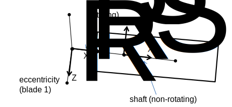
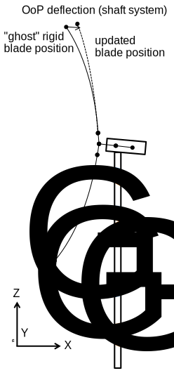
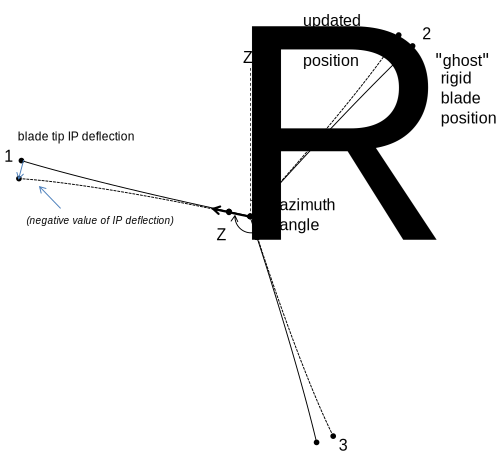

[[main_types_of_analysis]]
== Main Types of Analysis

[[main_general]]
=== General

Four main types of analysis are available in `RIFLEX`: 1. Static
analyses. 2. Static parameter variation analyses. 3. Dynamic time domain
analysis including eigenvalue analysis. 4. Frequency domain analysis.

The method of analysis is based on finite element technique which has
proved to be a powerful tool for several applications. The co-rotated
finite element formulation applied in `RIFLEX` allows for unlimited
translations and rotations in 3D-space.

The static analysis is based on a complete non-linear formulation.
However, a pre-processor based on catenary theory is also implemented.
The reason for this is to reduce computing time by giving the nonlinear
iteration a good starting point, but also to analyse simple problems
without use of the finite element method.

Time domain analysis is based on step by step numerical integration of
the dynamic equilibrium equations. It is possible to apply a complete
nonlinear method based on the incremental dynamic equilibrium equations,
or alternatively, a linearized approach by linearization of mass,
damping and stiffness matrices at the static equilibrium position.
Nonlinear hydrodynamic loading is, however, included in the linearized
time domain analysis.

The frequency domain analysis is based on the linearized dynamic
equilibrium equation at static equilibrium position by application of
stochastic linearization of the hydrodynamic loading.

All analyses are three-dimensional.

The mathematical models are described in detail in the Theory Manual.

[[main_static_analysis]]
=== Static Analysis

This is the elementary mode of analysis and is used for establishing
pipe configuration for a specified set of conditions.

###The computations include: 1. Establishment of initial configurations
based on catenary approximation. 2. Iteration for equilibrium position
by incremental reduction of unbalanced forces. (Newton-Raphson
iteration) by application of nonlinear finite element analysis.

Step 1 is optional and may be replaced by a zero-load initial
configuration.

Snap-through behaviour and multiple equilibrium configurations can be
discovered by incremental static analysis from different initial
positions. The program will be able to discover the appearance of kinks.
However, a detailed study of kinks including contact forces between pipe
elements is not included in the analysis.

###Basic results are: - Nodal point coordinates - Curvature at nodal
points - Axial force - Bending moment - Shear force - Torsion

The bending moments and the torsion moment are calculated about the area
center and the shear center, respectively. Note that all results refer
to the element coordinate system. The results are available as print
(tables), and stored on file for post processing and graphic
presentation.

[[main_static_parameter_analysis]]
=== Static Parameter Variation Analysis

The purpose of these analyses is to study the influence of varying key
parameters in the system. Key problems: - Establish static stiffness
characteristics in order to specify support vessel requirements with
regard to position-keeping. - Clarify sensitivity to support vessel
position, external force, or current variations.

For this purpose the following analyses are available: 1. Stepwise
increment supernode position in any direction. 2. Stepwise increment of
support vessel position. 3. Stepwise increment of current velocity or
direction. 4. Stepwise increment force components.

Combinations of above basic cases are also possible.

[[main_static_parameter_analysis_results]]
==== Results

The same results as for the basic static analyses are available, but the
main output consists of a set of key parameters to be presented as
function of the varied parameter. E.g. tension or curvature at selected
locations as function of position.

[[main_time]]
=== Time Domain Dynamic Response Analysis

The purpose of these analyses is to study the influence of support
vessel motions as well as of direct wave induced loads on the system.

A static analysis to define equilibrium condition is assumed to be
carried out before starting a dynamic analysis. The last step of a
parameter variation analysis can also be used as starting point for a
dynamic analysis.

The following types of dynamic analyses are included:

[arabic]
. Eigenvalue analysis
. Harmonic (periodic) excitation
* Forced displacements (harmonic) at one or more specified nodes
* Regular waves
. Irregular excitation
* Stochastic, stationary excitation due to support vessel motions and
irregular waves
* Transient excitation. Special options available to simulate release or
rupture, slug flow, time dependent current and external force variations

The mathematical models used in these analyses are described in the
Theory Manual.

[[main_time_results]]
==== Results

The basic results from the eigenvalue analysis will be the system’s
eigenfrequencies and eigenvectors. The basic result format from the
dynamic excitation analysis will be as time series of a selected,
limited number of response parameters: - Nodal point coordinates - Axial
force - Shear force - Curvature - Bending moment - Torsion

The bending moments and the torsion moment are calculated about the area
center and the shear center, respectively. Note that all results refer
to the element coordinate system. The parameters may be given as total
values or as difference from static equilibrium condition. In addition,
the total system configuration may be stored for a limited number of
time steps.

[[wind_turbine_results]]
===== Wind Turbine Results

An additional output file is created for analyses which include a wind
turbine. A columnwise description of the outputs is given in the witurb
key file. Several wind-turbine-specific coordinate systems are defined
in order to present the results. - Shaft system
latexmath:[$\mathrm{(XS,YS,ZS)}$]: Follows the non-rotating shaft
element. Wind output, azimuth, and out-of-plane (OoP) tip deflection
follow this system. - Rotor system latexmath:[$\mathrm{(XR,YR,ZR)}$]:
Follows the rotating shaft element and 1st blade. The blade tip in-plane
(IP) deflection follows this system.

.Rotor and shaft coordinate systems

.Outofplane deflection

.Inplane deflection

[[main_result]]
=== Result Post Processing and Graphic Presentation

Results from static and dynamic analyses are stored on file for
subsequent post processing and graphic presentation. An overview of main
types of output is given in the following:

[arabic]
. Output from static analysis:
* 2D and 3D plot of system geometry
* 2D plot of projected line geometries
* Plot of force variation along lines
* Print of forces, coordinates and element projection angles, optionally
element by element, segment by segment or line by line (direct output
from static analysis)
* Calculation/graphic presentation of pipe wall force (i.e. axial force
including hydrostatic pressure)
. Output from static parameter variation analysis:
* Print/plot of selected response quantities during parameter variation
* Plot of system geometries during parameter variation
. Output from dynamic time domain analysis:
* Computation of time series derived from basic response quantities
** calculation of curvature from nodal coordinates
** calculation of support forces
** wall force calculation (e.g. axial force including effects from
internal and external hydrostatic pressure)
** element angle calculation (e.g. angle between elements, vessel and
element and global axis and elements)
** calculation of distance time series (e.g. clearance between lines,
vessel and lines, global axis and lines)
* calculation of velocities and accelerations from wave and vessel
motion time series
* Plot/print of response time series
* Statistical time series analysis (e.g. estimation of spectral
densities, probabilistic distribution for maxima/minima, sample moments,
spectral moment, etc.)
* Animation of the dynamic behaviour of the complete system including
support vessel and exciting waves
* Graphic presentation of vessel motion transfer functions
* Envelope curves for displacements, curvature and forces showing static
value, mean value and response range

In addition to the post processing features available in `RIFLEX` it is
also possible to export results via standardized file formats to general
purpose statistical analysis programs (e.g. `STARTIMES`) and a advanced
graphical presentation/animation tools (e.g. `GLVIEW`).
